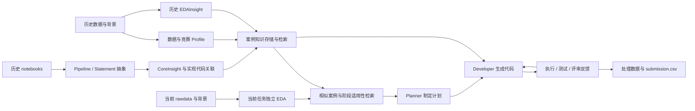
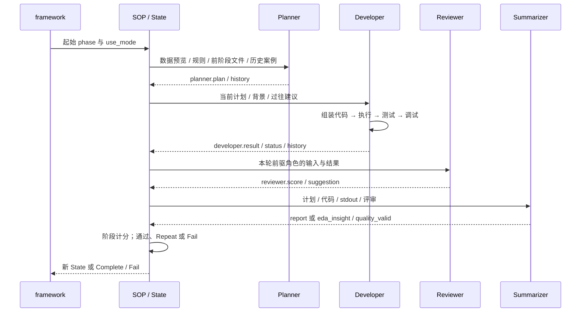
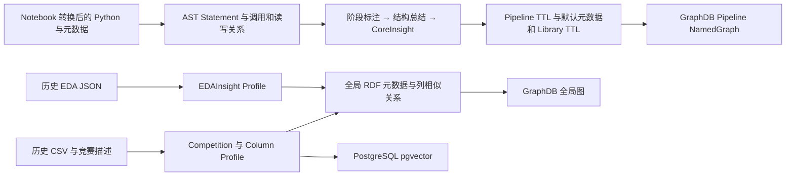
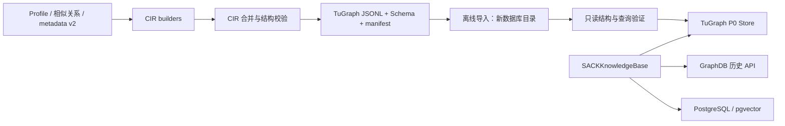

# SACK 项目交接手册

本手册面向第一次接触代码的维护者：先解释原项目如何利用历史数据科学案例指导当前任务，再说明 GraphDB → TuGraph 的实际迁移实现，以及本 PR 如何修复共用工作流。它依据当前代码和已保存的实验记录编写；设计方案、已实现代码、实际验证结果分别标注。

**代码阅读基线**：迁移实现主要来自 `b801441`，统一运行入口与 EDA 部署来自 `b4cbee2`，本 PR 的共用工作流修复为 `5035aaa`。文档补充不改变这份已完成双后端验收的业务源码。PR：[sxswa1/SACK#1](https://github.com/sxswa1/SACK/pull/1)，head `codex/titanic-workflow-fix`，base `codex/tugraph-migration`，保持 Draft。

## 阅读目录

1. [接手速览](#chapter-1)
2. [原项目 SACK 的原理与介绍](#chapter-2)
3. [从输入数据到预测结果的完整执行链路](#chapter-3)
4. [原 GraphDB 知识库如何构建](#chapter-4)
5. [知识检索如何影响 Agent 决策](#chapter-5)
6. [GraphDB → TuGraph 迁移设计与实际边界](#chapter-6)
7. [迁移实现结合代码](#chapter-7)
8. [本 PR 的修复：问题、修改、理由和回归](#chapter-8)
9. [环境部署与运行手册](#chapter-9)
10. [验证证据与 Titanic 实验结果](#chapter-10)
11. [故障排查与维护指南](#chapter-11)
12. [后续工作与交接清单](#chapter-12)

<a id="chapter-1"></a>

## 1. 接手速览

### 1.1 当前项目的定位

SACK 是论文配套的源码发布项目，核心能力是**历史案例知识检索增强的数据科学多 Agent 工作流**：读取新任务的数据与背景，生成 EDA、清洗和特征工程方案，执行 Python 工具和模型训练，经过阶段反馈最终生成预测文件。源码并不附带完整历史数据、知识数据库、模型权重、有效 API Key 或所有实验产物，不能把 clone 成功等同于运行环境准备完成。[发布边界](../README.md)、[知识模块](../sack/knowledge/README.md)

迁移方向实际是 **GraphDB → TuGraph**。GraphDB 仍是默认后端；TuGraph 覆盖当前 Agent 所使用的一组领域查询。PostgreSQL/pgvector 继续承担向量存储与相似检索。旧 GraphDB 公共 API 和旧知识构建流程并没有被一次性全部替换，具体边界在第 6、7 章。

### 1.2 先读什么、先做什么

| 接手目标 | 推荐阅读 | 第一次行动 |
| --- | --- | --- |
| 理解项目为什么这样设计 | 第 2–5 章 | 跟踪一条“数据画像 → 案例召回 → CoreInsight → 生成代码”调用链 |
| 修复 Agent 运行问题 | 第 3、8、11 章 | 找出失败阶段的生成脚本、stdout、error、review 和测试反馈 |
| 修改图查询或维护迁移 | 第 4–7、10 章 | 对照 GraphStore 契约、实际返回形状与迁移测试，不先改 Agent 提示 |
| 部署到新服务器 | 第 9–11 章 | 准备数据和模型资产，先做离线检查，再做只读服务预检 |
| 判断项目目前做到什么程度 | 第 10、12 章 | 阅读最终验收 JSON，同时检查未覆盖能力和缓存限制 |

建议前半小时先做代码和离线测试检查，不启动付费模型或重建数据库。重点文件是 [CLI](../sack/__main__.py)、[框架](../sack/framework.py)、[State](../sack/state.py)、[SOP](../sack/sop.py)、[检索器](../sack/Agents/agent_retriever.py)、[知识 API](../sack/knowledge/api/api.py)、[后端工厂](../sack/knowledge/stores/factory.py)。

### 1.3 已完成与未完成

| 项目 | 当前事实 |
| --- | --- |
| GraphDB 与 TuGraph 同版 Titanic 全流程 | 已顺序通过严格验收；原始数据哈希未变 |
| 原理/迁移实现/部署说明 | 本文与迁移目录提供代码入口；技术方案不代表全部已经实现 |
| 本地回归 | 修复基线完整测试 221 项通过，见最终验证记录 |
| Kaggle 后续提交 | 用户另行授权后，只改提交副本表头，两份均完成评分；见第 10 章 |
| 通用 SPARQL 替换、所有 GraphDB API、旧构建入口 | 未全面迁移 |
| 可重复得到完全相同的生成代码与预测 | 未保证；模型调用、统计抽样及训练过程具有随机性 |
| 隐藏集泛化与跨任务质量保证 | 单次 Titanic 分数不能代表所有任务，也不是数据库性能/因果优劣结论 |

现有成功证据位于 [最终验证摘要](../reports/sack-titanic-fix12-final-validation-20261005.md)、[最终精简证据](../reports/sack-titanic-fix12-final-evidence-20261005.json) 和 [Kaggle 后续提交记录](../reports/sack-titanic-kaggle-submissions-20261006.json)。历史失败记录保留，不能用旧版 GraphDB 的成功标签替代最终版更严格的输出验收。

<a id="chapter-2"></a>

## 2. 原项目 SACK 的原理与介绍

### 2.1 SACK 要解决什么问题

SACK 把一个数据科学任务拆成准备数据、理解背景、分析数据、清洗、构造特征、训练验证与预测等阶段，再让不同职责的 Agent 依次完成阶段内的工作。它的特色是把历史案例中的数据特征、处理经验和实现代码作为当前任务的参考：Planner 先参考相似任务的 CoreInsight 制定计划，Developer 再按计划中的案例引用获取对应代码片段。这样做的原因是，“所有缺失值都填均值”一类通用规则不足以应对真实数据；更有价值的参考是某种数据条件下采取过什么办法、为什么采取、以及怎样实现。实际的在线入口在 [CLI](../sack/__main__.py#L8)，知识参考分别进入 [Planner](../sack/Agents/agent_planner.py#L121) 和 [Developer](../sack/Agents/agent_developer.py#L365)。

这里的“多 Agent”首先是职责分工，不意味着多个进程同时争论：`SOP.step()` 根据配置顺序创建一个角色、调用 `action(state)`、把结果写入当前轮 memory，再让下一个角色接手。普通处理阶段依次是 Planner → Developer → Reviewer → Summarizer；背景理解阶段是 Reader → Reviewer。当前工厂使用 `qwen-plus` 承担阅读、规划、评审、总结，`qwen3-coder-plus` 承担开发，这些是代码中的模型选择，不是对结果质量的保证。[调度与模型工厂](../sack/sop.py#L38)、[角色顺序](../sack/config.json#L23)

SACK 不是训练一个可直接预测所有数据集的万能预测器。Agent 使用 LLM 理解文本、规划步骤、生成及修正 Python、整理结果；真正的数值分析与最终预测由当前任务生成的代码和 Pandas、NumPy、机器学习工具执行。建模阶段仍须在当前任务的训练集上训练模型、做验证，再预测当前测试集。已有案例提供的是经验与代码参考，不会替代当前数据上的训练。[Agent 的 LLM 包装](../sack/Agents/agent_base.py#L26)、[阶段目标](../sack/state.py#L116)、[生成代码与执行](../sack/Agents/agent_developer.py#L47)

### 2.2 输入、输出以及三种证据

一个在线任务以竞赛目录名作为标识，原始文件放在 `data/competitions/<competition>/rawdata/`。准备阶段把原始输入统一为 `train.csv`、`test.csv`、`sample_submission.csv`、`overview.txt`；Reader 进一步产出 `competition_info.txt`。后续阶段分别形成 `cleaned_train.csv / cleaned_test.csv`、`processed_train.csv / processed_test.csv`，最终形成 `submission.csv`，并留下计划、代码、日志、评审和报告。源码发布包不含基准数据、生成知识、运行数据库和本地实验产物，拿到源码并不等于已经具备可运行的案例库。[数据布局](../README.md#L50)、[准备与处理产物](../sack/state.py#L69)、[提交文件检查](../sack/Tools/unit_test.py#L544)、[发布边界](../README.md#L3)

在这个流程中，要把三种信息分清：

| 信息来源 | 作用 | 不能据此直接断言什么 |
| --- | --- | --- |
| LLM 的解释、计划与评分 | 理解目标、选择行动、生成可读报告 | 不能证明代码已成功执行，也不能证明泛化性能优秀 |
| Python 与预定义工具的结果 | 计算缺失率、相关性、特征与预测，产生可检查文件 | 程序退出成功不代表数据列、行数、预测格式正确 |
| 执行日志与阶段测试 | 把异常、超时、不合格输出反馈给 Developer | 文件与结构通过检查不等于排行榜分数高 |

因此 Developer 不只输出回答，还提取回答中的 Python 代码块，组装脚本、运行脚本、记录标准输出和错误，再用阶段测试检查结果；Reviewer 会强制把执行或测试失败的 Developer 置为 0 分。评审仍含模型判断，但不能用好看的文字掩盖执行失败。[代码执行](../sack/Agents/agent_developer.py#L115)、[测试反馈](../sack/Agents/agent_developer.py#L239)、[失败覆盖评分](../sack/Agents/agent_reviewer.py#L122)

以 Titanic 为贯穿例子：任务不是让 LLM 凭前几行旅客资料直接逐行猜生还结果，而是先明确训练标签 `Survived`、旅客标识与提交格式，检查 `Age`、`Cabin` 等字段的缺失和类型，再考虑编码、构造特征与验证分类模型。文档中的这些处理是解释流程的示例，具体填补策略、特征组合和模型要由当次计划与执行产物确认，不能把示例当成某次实验已经做过的事实。Agent 的数据预览通常只读取少量行；全量统计依赖生成代码和工具，因此预览样本中的印象需要全量计算验证。[分阶段数据预览](../sack/Agents/agent_base.py#L182)、[Planner 预览行数](../sack/Agents/agent_planner.py#L94)

### 2.3 知识构建与在线任务是两条路径

历史知识路径先整理历史竞赛数据、背景资料和 notebooks：数据 profiling 描述“这个案例的数据是什么样”，Pipeline 抽象描述“历史代码做了什么”，CoreInsight 提炼描述“哪些做法有可迁移价值”。独立 EDA 还产生固定结构的 EDAInsight，为案例相似性与适用性判断提供信号。在线任务则生成自己的 EDAInsight、检索相似案例及适用经验，把它们提供给 Planner 和 Developer，再通过当前数据上的执行反馈修正方案。[模块职责](../sack/knowledge/README.md#L7)、[历史源码分析](../sack/knowledge/kg_governor/pipeline_abstraction/abstract_pipelines.py#L420)、[当前案例 EDA 读取](../sack/Agents/agent_retriever.py#L751)



该图表示模块关系，不代表 `build-knowledge` 单个命令已经自动串起所有构建步骤。当前 `build_knowledge.main()` 明确调用 profiling、全局数据图构建、GraphDB 图加载、嵌入表创建和填充，但没有直接调用 `abstract_pipelines()`；Pipeline 图加载使用已经存在的输出目录。完整知识构建需要满足这些前置产物，具体细节见后续知识章节。[实际构建入口](../sack/knowledge/build_knowledge.py#L24)

### 2.4 六个容易混淆的概念

| 概念 | 在项目里的含义与边界 | Titanic 解释示例 |
| --- | --- | --- |
| Dataset | 案例数据的组织单位，关联其表、字段和 Pipeline；不等于训练好的模型 | Titanic 案例及其 train/test 表 |
| Profile | 从数据、背景或 EDA 中提取并持久化的描述，包括统计特征、语义文本、嵌入和结构化元素；是检索材料 | 行列规模、字段类型、背景说明、缺失分布 |
| Pipeline | 某份历史 notebook/代码对应的处理流程，带来源及评价元信息；同一 Dataset 可以有多份 Pipeline | 某个历史作者的清洗、编码和分类流程 |
| Statement | Pipeline 中可定位的源码语句节点，有文本、顺序和阶段；用于追溯实现及代码片段 | 对 `Age` 做处理的一条语句 |
| EDAInsight | 对数据质量、分布、关系、复杂度等的固定结构分析摘要；重点是“数据有什么信号” | 缺失分布、类别基数、特征与标签关系 |
| CoreInsight | 从历史 Pipeline 提炼的处理经验，保存描述、证据、适用阶段等，并关联实现语句；重点是“采取了什么有效做法” | 某案例中为何采用某种编码及其实现证据 |

这组区分可以避免把“数据上出现相关性”直接写成“某方法已被证明有效”，也避免把历史片段机械复制成当前任务的完整脚本。Profile 的具体字段见 [CompetitionProfile](../sack/knowledge/kg_governor/data_profiling/model/competition_profile.py#L7)、[EDAInsightProfile](../sack/knowledge/kg_governor/data_profiling/model/edainsight_profile.py#L7)；Pipeline、Statement、CoreInsight 的源码结构与关联见 [schema](../sack/knowledge/graph/schema_registry.py#L110) 和 [关系定义](../sack/knowledge/graph/schema_registry.py#L239)。该 schema 是当前实现中的结构契约，不能仅据此推断所有在线后端已经完成迁移。

<a id="chapter-3"></a>

## 3. 从输入数据到预测结果的完整执行链路

### 3.1 CLI 如何进入真正的运行流程

统一调用形式如下。第二条用于在需要完整重做当前预测流水线时显式指定起点，并不绕过 EDA 状态检查。

```bash
python -m sack run --competition titanic
python -m sack run --competition titanic --dsp-start-phase "Data Preparation"
```

`sack.__main__.main()` 解析参数，`_run_competition()` 调用 `framework.run_sack_pipeline()`。默认 EDA 起点是 `Data Preparation`，默认 DSP 起点是 `Feature Engineering`；兼容旧调用时，首个参数若以 `--` 开头，会自动补上 `run` 子命令。框架先确认当前竞赛目录存在，再读取 `sack/competition_process_status.json`，决定是否执行 EDA。路径从仓库根目录解析，当前数据与独立 EDA 数据分别放在 `data/competitions/` 和 `data/eda_competitions/`。[CLI 参数](../sack/__main__.py#L39)、[框架入口](../sack/framework.py#L148)、[路径常量](../sack/paths.py#L6)

当前显式传入的 `use_mode` 会随 SOP 创建新 State 一直传下去。因此 `config.json` 默认写着 `GetEDAInsight` 不会让框架中的 DSP 路径误用 EDA Agent 表；该显式模式传播和统一框架入口属于既有部署基线 `b4cbee2`，不是 `5035aaa` 新增的行为。`config_path` 虽出现在框架函数签名中，当前 SOP/State 仍直接读取 `SACK_CONFIG_PATH`，它不是一个已落实的任意配置文件切换接口。[显式模式](../sack/framework.py#L93)、[SOP 模式传播](../sack/sop.py#L24)、[State 配置选择](../sack/state.py#L32)

### 3.2 独立 EDA 与 DSP 的阶段、文件和交接

| 模式 | 按当前配置顺序执行的 phase | 工作目录 |
| --- | --- | --- |
| `GetEDAInsight` | Data Preparation → Understand Background → Preliminary Exploratory Data Analysis → Data Cleaning → PEDA Insight Extraction → IEDA Insight Extraction | `data/eda_competitions/<competition>/` |
| `DSPipeline` | Data Preparation → Understand Background → Preliminary Exploratory Data Analysis → Data Cleaning → In-depth Exploratory Data Analysis → Feature Engineering → Model Building, Validation, and Prediction | `data/competitions/<competition>/` |

阶段子目录分别是 `data_preparation`、`understand_background`、`pre_eda`、`data_cleaning`、`deep_eda`、`feature_engineering`、`model_build_predict`；两类洞察提取使用 `pre_insight_extraction`、`deep_insight_extraction`。独立 EDA 的 PEDA 在阶段顺序上排在清洗之后，但其读取的数据仍是原始标准化 `train.csv/test.csv`；IEDA 读取的是清洗后的数据。不要仅按目录顺序推断它们的输入。[阶段与目录配置](../sack/config.json#L6)、[State 的目录选择](../sack/state.py#L48)、[洞察阶段输入](../sack/state.py#L127)

框架只有在独立 EDA 目录不存在时，才把当前竞赛整个目录复制过去。EDA 成功后，只复制回 `train.csv`、`test.csv`、`sample_submission.csv`、`overview.txt`、`competition_info.txt`、`data_preparation/`、`understand_background/`。EDAInsight 保留在独立 EDA 目录，由检索器在那里读取；框架并未把 `cleaned_*.csv` 或 `data_cleaning/` 复制回来。因而从默认 `Feature Engineering` 启动需要当前任务目录已存在清洗数据和相关代码，尤其 Planner 的数据预览会先读取 `cleaned_*.csv`。在只有 rawdata 的新目录中，不能把“EDA 成功”当成这些 DSP 前置文件都已齐全。[复制清单](../sack/framework.py#L178)、[特征工程预览输入](../sack/Agents/agent_base.py#L190)、[上一相关阶段代码](../sack/Agents/agent_developer.py#L33)

状态 JSON 记录的是各竞赛 EDA 的 `success/fail`，不是 DSP 每个阶段的完整检查点；兼容成功的布尔值与字符串。它不逐一验证磁盘上的输入产物仍存在、未损坏或与 rawdata 同版本。批量历史 EDA 命令使用同一路径的状态文件，但通过独立入口运行。[状态解释](../sack/framework.py#L121)、[状态读写](../sack/framework.py#L129)、[历史 EDA 入口](../sack/__main__.py#L26)

### 3.3 每个阶段如何工作，以及 memory 怎样流动

框架创建 `SOP(competition, use_mode=...)` 和起始 `State`，然后反复调用 `sop.step()`。State 保存阶段名、模式、角色列表、工具名单、当前角色索引、分数、目录和 `memory=[{}]`；每个角色返回一个以角色名为键的字典，合并到 `memory[-1]`。阶段通过时才创建下一阶段 State；下一阶段重新初始化 memory，并通过文件获取此前的计划、报告和代码。阶段重做则深拷贝所有此前轮次的 memory，再追加空字典，保留的是“同一阶段各轮经验”。[SOP 执行](../sack/sop.py#L65)、[State 字段](../sack/state.py#L16)、[重复状态](../sack/sop.py#L125)



Reader 在背景阶段读取 `overview.txt` 和数据预览，整理任务目标、背景和输出要求，写入 `competition_info.txt`。普通 Planner 把背景、阶段规则、此前计划及报告、可用工具和适用的历史经验组成提示，输出 Markdown 与 JSON 计划；其跨阶段读取主要依赖 `plan.json` 与最近相关阶段的 `report.txt`。注意普通 Planner 在本阶段 Repeat 时，无论上一轮 Planner 是否达 3 分，都直接复用此前计划；它并没有完整的低分重新规划逻辑。修复后的 EDAPlanner 才明确在 Repeat 中加入质量反馈，要求补齐缺失工具、字段并修改计划。[Reader](../sack/Agents/agent_reader.py#L26)、[前阶段文件读取](../sack/Agents/agent_planner.py#L29)、[普通计划复用](../sack/Agents/agent_planner.py#L178)、[EDA 重新规划](../sack/Agents/eda_agent/eda_planner.py#L53)

Developer 读取本轮 `planner.plan`，按引用检索历史实现片段，组合当前计划、数据、工具与上一相关阶段代码生成脚本。它不是仅运行当前代码块：会抽取前一阶段函数主体，去除部分历史输出语句后与本阶段代码拼接，形成 `*_code.py` 和 `*_run_code.py`，另存当前片段为 `single_phase_code.txt`。例如 Titanic 特征工程可以在同一运行函数中接续清洗代码，保持变量上下文；但这不改变前述启动前必须满足文件预览输入的条件。[Developer 输入](../sack/Agents/agent_developer.py#L354)、[代码拼接](../sack/Agents/agent_developer.py#L47)、[语句抽取辅助](../sack/runtime_support.py#L127)

Reviewer 评审本轮已经执行过的角色，而不是直接评审所有未来阶段。普通 Summarizer 从角色轨迹、代码、输出和必要的图像信息组织问答式阶段报告，为下一阶段提供结论；建模阶段还汇总为 `research_report.md`。EDASummarizer 则把当前工具输出填入固定洞察模板，分别保存 `eda_insight_with_evidence.json`、`eda_insight.json`、`eda_insight_validation.json`。因此“保存了工具输出到任意 JSON”不等于总结器已经看到它，EDA 提示要求把结果打印到 stdout 供提取。[Reviewer 输入](../sack/Agents/agent_reviewer.py#L75)、[普通报告](../sack/Agents/agent_summarizer.py#L99)、[最终报告](../sack/Agents/agent_summarizer.py#L172)、[EDA 输出](../sack/Agents/eda_agent/eda_summarizer.py#L300)

短期 `history` 是某个 Agent 调用 LLM 时的对话记录；State memory 是本阶段的角色结果及重做经验；跨阶段文件是可落盘的工作交接；历史知识库则是跨任务的案例参考。这四者不能统称为同一份“长期记忆”。阶段重做时，开发角色会读取其过去结果、评审建议、分数与错误日志加入新提示；过去对话并不会无限原样拼接。[经验收集](../sack/Agents/agent_base.py#L61)、[Developer 对话重置](../sack/Agents/agent_developer.py#L413)、[memory 落盘条件](../sack/sop.py#L84)

还有一个落盘边界：`SOP.step()` 只在返回 `Success` 时调用 `restore_memory()`，末阶段直接返回 `Complete`，因此不能假设每个最终完成阶段都一定有 `memory.json`；角色自身保存的 history、review 和输出文件仍需分别检查。[末阶段返回](../sack/sop.py#L97)、[落盘分支](../sack/sop.py#L81)

### 3.4 评分、重试和失败边界

阶段通过阈值是 **3 分**。Reviewer 的有效评分被规范为 0–5 的有限数值；阶段分数通常为各已评角色评分的平均值。若 Developer 评分为 0，或者 EDASummarizer 返回 `quality_valid=False`，阶段分数直接归零。`5035aaa` 增加了后者：任何 unknown 字段、缺失 schema 字段、缺失映射工具输出均会使当前 EDA 洞察不通过，并把补齐建议放进评审建议供下一轮使用。源码中低于 60% 完整度的提示只是建议生成条件，**不是当前 EDA 的通过阈值**。[评分规范](../sack/runtime_support.py#L86)、[阶段计分](../sack/state.py#L246)、[洞察质量门](../sack/Agents/eda_agent/eda_summarizer.py#L434)

重试有多个嵌套层级，不能把它们混成“最多重试三次”。SOP 的普通阶段 3 轮与模型阶段 4 轮计数方式在既有部署基线 `b4cbee2` 已存在，`5035aaa` 没有调整该迭代算法：

| 层级 | 当前实现边界 | 源码 |
| --- | --- | --- |
| 框架重新运行整条独立 EDA | 最多 3 次尝试，每次重新创建 SOP；成功即退出 | [framework](../sack/framework.py#L53) |
| 普通阶段 / EDA 提取阶段重做 | SOP 上限写死 3；初始计数为 0，先增计数再判断，通常最多 3 轮 | [SOP](../sack/sop.py#L107) |
| 最终建模阶段重做 | 失败时先检查再增计数，初始为 0 时实际可执行首轮加 3 次 Repeat，共 4 轮 | [模型阶段分支](../sack/sop.py#L97) |
| Developer / EDADeveloper 内部生成与调试 | `max_tries=5`，`round` 从 0 到 5，外层还以 `total_cycles<10` 限制 HELP/重新生成循环；不是严格 5 次 LLM 调用 | [普通开发](../sack/Agents/agent_developer.py#L331)、[EDA 开发](../sack/Agents/eda_agent/eda_developer.py#L28) |
| Developer 内部测试修复循环 | `test_round<10`；另有 `test_round==5` 的退出分支，普通 Developer 在最终成功修复后再测一次，不宜描述成统一精确测试次数 | [测试循环](../sack/Agents/agent_developer.py#L457)、[最终补测](../sack/Agents/agent_developer.py#L482) |
| Reviewer JSON 格式修复 | 原回复解析失败后只允许 1 次重排，第二次仍失败则抛错 | [评审解析](../sack/Agents/agent_reviewer.py#L43) |
| 普通 Agent JSON 格式修复 | 初次严格解析失败后重排 1 次，再解析失败向外抛错 | [基础解析](../sack/Agents/agent_base.py#L223) |
| EDAInsight 填充响应 | 空响应或调用异常最多 3 次尝试；有非空响应后进入解析与质量检查，失败模板不能绕过质量门 | [填充循环](../sack/Agents/eda_agent/eda_summarizer.py#L386) |

执行超时按 phase 名匹配：含 `Analysis` 的阶段为 1200 秒，含 `Model` 的为 28800 秒，其余为 3600 秒。因此名称为 `PEDA Insight Extraction / IEDA Insight Extraction` 的两阶段走 3600 秒分支。时间限制只是单次脚本执行预算，多层重试可能使总任务时间明显更长。[执行超时](../sack/Agents/agent_developer.py#L162)

`5035aaa` 对开发路径增加了组装脚本语法检查、EDA 工具关键字检查与有界重新生成循环，对 Reviewer 增加严格格式和分值校验，对 EDA 增加质量回流。这些修复改善的是执行与证据契约，不能写成已经证明预测结果完全等价、所有模型都适用或所有知识后端已全面迁移。[语法与工具检查](../sack/Agents/agent_developer.py#L143)、[运行支持](../sack/runtime_support.py#L20)

### 3.5 参数和失败回退的准确含义

`--force-eda` 忽略已有 EDA 成功状态，重新尝试独立 EDA；它不会自动删除或从当前 rawdata 重新复制一个已经存在的 EDA 目录。`--skip-eda` 要求状态文件已有成功记录，否则立即报错；它不是“允许没有 EDA 也继续”。两参数同时提供时，代码先检查 `skip_eda` 分支，所以 skip 优先。`--eda-start-phase` 只改变每次独立 EDA 的起点；`--dsp-start-phase` 只改变 DSP 起点，均不会自动重建所跳过的阶段产物或加载一份完整 State 检查点。[参数决策](../sack/framework.py#L166)、[起始 State](../sack/framework.py#L94)、[EDA 起始 State](../sack/get_history_edainsight.py#L89)

若三次独立 EDA 均失败，框架把状态写为 `fail`，强制 DSP 从 `Data Preparation` 开始，覆盖用户指定的 DSP 起点；它仍会执行包含 EDA 分析阶段的普通 DSP，这是“洞察提取失败后的完整数据科学流程回退”，不是完全取消数据探索。如果 DSP 某阶段耗尽评分重试，框架抛出 `SACKPipelineError` 停止；没有实现自动回退到特征工程再重选模型的完整循环。历史 EDA 的异常会转为 `fail` 返回并记录日志。`5035aaa` 在 SOP 的两类失败分支中把 `("Fail", None)` 改为 `("Fail", state)`，并在历史 EDA 的失败日志中保留阶段名与分数；这是保留诊断上下文的修复，未改变上述重试次数，也未新增自动回退算法。[EDA 回退](../sack/framework.py#L182)、[DSP 失败](../sack/framework.py#L111)、[独立 EDA 异常](../sack/get_history_edainsight.py#L93)

案例检索器初始化不可用时，普通 Agent 可记录警告并继续缺少案例参考的路径；Developer 获取片段异常也会降级为空片段。Planner 并没有把后续所有检索调用包在同等范围的 try/except 中，所以不能承诺任意知识服务故障都能无损降级。缺少案例仍能生成方案与代码，也不代表运行了完整的知识增强实验。[检索器懒初始化](../sack/Agents/agent_base.py#L37)、[开发片段降级](../sack/Agents/agent_developer.py#L366)、[Planner 检索调用](../sack/Agents/agent_planner.py#L123)

### 3.6 Titanic 从输入到最终预测的检查点

沿完整 DSP 起点看，Titanic 的标准化输入先把任务标识、标签与提交模板固定下来；背景理解明确分类目标和评价要求；初步分析给出数据质量信号；清洗输出保留标签、行数及测试样本对应关系；特征工程输出训练、测试间可对齐的预测字段；建模使用训练标签拟合分类器，以验证结果选择方案，再按 `sample_submission.csv` 的标识与顺序写出实际预测。[各阶段目标](../sack/state.py#L69)、[清洗与处理行数检查](../sack/Tools/unit_test.py#L641)

最终验收应查看当前任务的 `submission.csv`、建模脚本、输出日志、`review.json` 与研究报告，确认输出确实来自当次模型预测。修复后的提交验证检查列名及顺序、行数、缺失、ID 及其顺序、数值有限性，并结合训练标签和模板区分类别值或概率范围；它明确不把预测分布强行调整成样例分布。测试通过说明提交契约满足本地规则，模型性能仍要看当次验证方法与评价结果。[提交验证](../sack/Tools/unit_test.py#L544)、[最终研究报告](../sack/Agents/agent_summarizer.py#L172)

<a id="chapter-4"></a>

## 4. 原 GraphDB 知识库如何构建

### 4.1 输入、产物与真正的执行边界

历史知识是三路输入的汇合：竞赛 CSV 与 `overview.txt`、`data_description.txt` 提供数据及任务描述；Notebook 对应的 Python 源码与 `pipeline_info.json` 提供解决方案、作者、日期和评分；`pre_eda`、`deep_eda` JSON 提供数据质量、分布、关系、复杂度和特殊场景。竞赛目录中的 `notebooks/<pipeline>/` 必须已包含可解析 `.py` 文件，抽象器不会直接执行 Notebook 来发现运行时行为。数据采集、Notebook 转换、历史 EDA 生成属于上游准备工作，不能把目录存在视为这些内容已齐备。

实际入口 [build_knowledge.main](../sack/knowledge/build_knowledge.py) 的核心顺序是：

```python
profile_data()
build_data_global_schema()
# 随后导入全局图、上传已有 pipeline 图，再重建并填充两个向量库
```

它**没有调用 `abstract_pipelines()`**。完整建库需先独立完成 pipeline 抽象并检查输出，再运行这个入口。否则可能得到可检索的竞赛和列，却没有可供 Planner 推荐的 CoreInsight。`populate_pipeline_graphs()` 上传已有 TTL，并不补生成缺失经验。[abstract_pipelines](../sack/knowledge/kg_governor/pipeline_abstraction/abstract_pipelines.py)、[GraphDB 导入函数](../sack/knowledge/storage_utils/graphdb_utils.py) 是这两条职责的实际边界。



图中 AST/模型抽象与 Profile 可以分别准备；箭头表示产物依赖，不表示一个 CLI 已自动完成全部步骤。`create_columns_embedding_db()` 和 `create_competition_embedding_db()` 会删除并重建目标数据库，`build-knowledge` 是整库构建工具，不是安全的增量追加命令。[embedding_store_utils](../sack/knowledge/storage_utils/embedding_store_utils.py)

### 4.2 Profile：统计与向量分别承载什么

[profile_data](../sack/knowledge/kg_governor/data_profiling/profile_data.py) 初始化 Spark，枚举 CSV 表头，再按列读取、做细粒度类型判断并交给不同 `ProfileCreator`。Profile 保存列 ID、表及竞赛归属、类型、总量、缺失量、不同值数量；数值列进一步保存均值、标准差、范围、中位数和 IQR，布尔列保存 true ratio。竞赛描述通过结构化抽取生成 `problem_type`、`data_type`、domain 等筛选字段，描述本身仍保存；EDA JSON 转成两类独立 EDAInsight Profile。

列内容向量并非“把上述统计量拼接后交给模型”。[ProfileCreator._generate_embedding](../sack/knowledge/kg_governor/data_profiling/profile_creators/profile_creator.py) 对预处理后的**非缺失采样值**调用预训练 embedding/scaling 模型，分别对输出取均值，得到 300 维内容向量与一个 scaling factor。数值预处理转 float32 的位表示；字符串先经 chars2vec `eng_50`；自然语言文本先分词，对每条文本最多随机取 100 个 token 的 FastText 词向量求平均，再进入模型。列非缺失数超过 10,000 时抽取约 10%，否则最多 1,000 个值；采样没有统一固定随机种子，重复生成未必逐位相同。空列使用零向量和 scaling factor=1。[数值预处理](../sack/knowledge/kg_governor/data_profiling/profile_creators/numerical_profile_creator.py)、[字符串预处理](../sack/knowledge/kg_governor/data_profiling/profile_creators/string_profile_creator.py)、[文本预处理](../sack/knowledge/kg_governor/data_profiling/profile_creators/natural_language_text_profile_creator.py)

向量库有三个层次，含义不能混用：

| 层次 | 实际生成方式与用途 |
| --- | --- |
| 竞赛 overview / data_description | `cc.en.300.bin` 对文本词向量求平均，各 300 维，分别支持任务语义与宏观数据描述评分 |
| 列 label / content | label 用 300 维 FastText 句向量表达列名；content 用类型模型表达列值，支持列匹配 |
| content_label | 两个 300 维向量直接连接成 600 维；数据库存储并建索引，但当前 Agent 的表列评分分别取 label/content，没有使用此拼接向量 |

50 维 FastText 还参与类型判断和表名辅助评分，不能因为库里主要向量为 300 维就忽略该资源。历史向量入库对布尔列使用 `[true_ratio] * 300`；当前竞赛 `profile_single_competition()` 对没有 embedding 的列使用零向量，两侧此处并非完全一致。[向量入库](../sack/knowledge/storage_utils/embedding_store_utils.py)、[当前 Profile](../sack/knowledge/api/utils.py)

当前竞赛 Profile 的缓存修复把“文件可读”提高为“内容完整且输入未变”：`profile_input_manifest()` 对 CSV、overview、data_description 计算 SHA-256；`generate_competition_profile()` 只复用通过验证且 manifest 一致的缓存，旧缓存没有输入哈希也会重建。每张表保留 `expected_columns`，核对实际列覆盖；schema version 2 要求列的 label/content 都是长度 300 的有限数值列表。单列失败会记录 `profile_errors.json` 并使整个生成失败，不允许静默保存残缺 current_comp。这仍不能推出历史批量 Profile 同样完整：历史 `column_worker()` 捕获异常后跳过列，历史缓存主要按 ID 的 MD5 文件名判断存在；需要检查历史建库日志与覆盖率。[generate_competition_profile / _validate_current_comp](../sack/knowledge/api/api.py)、[profile_input_manifest / profile_single_competition](../sack/knowledge/api/utils.py)

### 4.3 AST、Pipeline 与 CoreInsight 的连接

[pipeline_analysis](../sack/knowledge/kg_governor/pipeline_abstraction/abstract_pipelines.py) 先 `ast.parse()`，再用 [NodeVisitor](../sack/knowledge/kg_governor/pipeline_abstraction/pipeline_abstraction.py) 抽取 Statement、调用、参数、读取表列、控制流及数据流，给 Statement 分配 `s1` 等 URI。语法无法解析或 AST 超过 13,000 节点会跳过，不代表历史所有 Notebook 均已入库。已有 TTL 的任务也会被跳过，即使之前 CoreInsight 抽取未完成。

源码与节点描述进入 `pipeline_core_insight_analysis()` 的三个实际模型步骤：节点阶段标注、基于标注的 pipeline 结构总结、基于结构及压缩节点信息的经验提取。全部成功才写回阶段并生成 CoreInsight；任一失败则回退为普通 pipeline RDF。函数注释中的“两阶段”与实现的三个调用不同，交接以代码为准。

[json_to_rdf](../sack/knowledge/kg_governor/pipeline_abstraction/json_to_rdf/__init__.py) 将结构落为可追踪的实体关系：`Column → sack:isPartOf → Table → Dataset → Source`；`Pipeline → sack:isPartOf → Dataset`；`Statement → sack:isPartOf → Pipeline`。Statement 通过 `pipeline:callsAPI` 及 callsFunction/Class/Package/Library 连接 API 家族，通过 readsTable/readsColumn 连接数据，并保留文本、阶段、顺序、控制流、数据流和参数。Pipeline 默认元数据记录标题、作者、日期、votes、score；单 pipeline TTL 保存详细节点。API 本体中 Library、Package、Class、Function 是 API 的子类，旧 [LiDS 本体文档](../sack/knowledge/docs/LiDS_ontology.md) 是背景参考，扩展的 CoreInsight/EDA 字段需看当前生成代码。

CoreInsight URI 为 `<pipeline_uri>/insight/<insight_id>`，保存描述、类型、effectiveness、evidence、belongsToPhase；跨阶段经验另存 spansPhase。Pipeline 经 `sack:hasCoreInsight` 指向经验，经验经 `sack:implementedIn` 指向实施 Statement。这个连接使下游先推荐方法，再按被引用的方法回查代码；CoreInsight 不是与源码脱离的一段摘要。

### 4.4 全局相似边、NamedGraph 与双存储

[DataGlobalSchemaBuilder](../sack/knowledge/kg_governor/data_global_schema_builder/build_data_global_schema.py) 合并 Profile 为全局 RDF：归属、列统计、竞赛结构化字段及挂在竞赛上的 Preliminary/InDepth EDAInsight。默认还调用 [column_pair_similarity_worker](../sack/knowledge/kg_governor/data_global_schema_builder/workers.py)，只比较**类型完全相同且不在同一张表**的列；`SACK_SKIP_SCHEMA_SIMILARITY` 可跳过此步骤。当前三个建边阈值均为 0.75。

标签相似使用归一化词向量：标签相同为 1，多词标签先去掉共有 token，对剩余 token 两两点积取平均；遇到未知 token 为零。函数虽然叫 `get_distance_between_column_labels()`，返回的实际是相似分数。布尔内容相似为 `1 - abs(true_ratio1 - true_ratio2)`；其他内容相似为 `1 - tanh(||e1-e2||₂ + scaling1 + scaling2)`。达到阈值才生成双向 RDF-star，例如：

```turtle
<< <columnA> data:hasContentSimilarity <columnB> >> data:withCertainty 0.83 .
```

certainty 是相似算法分数，并非人工评审准确率。全局图中 CoLR/scaling 公式与 Agent 在线列匹配的余弦公式不同，不能拿某条边的 certainty 当在线 micro score。

构建产物应按用途验收，而不能只检查服务返回成功：全局 RDF 要包含竞赛任务/数据类型，才能进入候选筛选；表列归属及同 ID 的 PG embedding 要同时存在，才能得到 micro 分；默认 Pipeline 元数据要有 score 等查询所需字段，才能选出 top Pipeline；具体 TTL 要有 hasCoreInsight 与 implementedIn，才能从推荐一路回查代码。历史 EDA JSON 的两条相对路径是 `pre_insight_extraction/eda_insight.json` 与 `deep_insight_extraction/eda_insight.json`，从配置的历史 EDA 根目录读取，未必位于 CSV 根目录。缺少这些输入时可能只得到部分图层，不能宣称知识构建完整。

GraphDB 载入全局 RDF，pipeline 根目录的默认/库 TTL 进入默认图，每个具体 pipeline TTL 则按 Statement URI 推导 NamedGraph URI 上传。NamedGraph 保留某方案的上下文边界，查询可按 Pipeline 找经验及实施节点。PostgreSQL 则保存竞赛与列向量；图中 URI 去除资源前缀后与 PG 行 ID 对齐。当前迁移允许部分 Agent 图访问转到 graph store，但 pgvector 仍参与评分；不是用 TuGraph 自动替换这些向量与全部旧 SPARQL/RDF-star 能力。

<a id="chapter-5"></a>

## 5. 知识检索如何影响 Agent 决策

### 5.1 从当前任务到历史候选的实际 API 顺序

Planner 在 `DSPipeline` 且非 Data Preparation 阶段调用 [get_similar_comp_coreinsight](../sack/Agents/agent_retriever.py)，**显式选择 `recall_rerank`**，取 5 个竞赛，每个竞赛最多 3 个高 score Pipeline。无缓存时顺序为：生成当前 Profile → `get_top_k_similar_competitions(return_all=True)` → `get_top_k_edainsight_similar_competitions(return_all=True)` → 按 Competition_ID 外连接原始分数 → 当前阶段排序 → 逐竞赛取 overview → `get_top_k_scoring_pipelines_for_dataset()` → `get_core_insights_for_pipeline()` → 按阶段筛选与 Hybrid Gate。存在 `similar_competitions_df.csv` 时直接复用原始分数后重算阶段排序；因此跨阶段不必重新生成所有 Profile。[Planner 调用点](../sack/Agents/agent_planner.py)

两类相似 API 都先用图中 `hasProblemType`、`hasDataType` **精确匹配**，排除当前 URI，没有“无候选就自动放宽类型”的逻辑。图层给候选、归属与描述，PG 给历史向量。相关核心函数实际集中在 [api/template.py](../sack/knowledge/api/template.py)，不存在独立 `core.py`。

当前 Profile 可以显式传 `source_path` 指向真实 CSV，但 EDA 相似 API 随后仍根据 `current_comp_path` 和 comp_id 最后一段寻找 EDA JSON；Gate 的本地 EDA又走 Retriever 自己的读取路径。接手自定义竞赛目录时需核对这几处路径确实指向同一任务，不能仅凭 Profile 生成成功推断 EDA 已正确读取。当前读取函数只保留 FIELD_WEIGHTS 声明的路径；JSON 中额外字段不会自动进入相似度计算。

### 5.2 基础分数：语义、macro、micro 如何融合

令 S 为 overview 分数、M 为 data_description 分数、U 为表列 micro 分数。PG 实际 SQL 是 `1 - (embedding <-> current_vector)`，`<->` 为欧氏距离；此处不能称为余弦相似，也没有显式把结果截断到 [0,1]。实际 API 从配置传入权重：

```python
fused_data_score = round(macro_score * 0.3 + micro_score * 0.7, 3)
total_score = round(sem_score * semantic_weight + fused_data_score * data_weight, 3)
```

即 D=0.3M+0.7U，B=0.6S+0.4D。core 函数签名默认 0.4/0.6，但 API 覆盖为配置的 0.6/0.4，阅读默认参数不能得出当前运行权重。[评分实现](../sack/knowledge/api/template.py)、[配置权重](../sack/knowledge/knowledge_config.py)

micro 的匹配是当前数据到历史数据的有方向最佳匹配：先按 `TYPE_COMPATIBILITY` 跳过不兼容列（int/float 互通，三类文本互通，boolean/date 各自匹配），对兼容列计算 label/content 余弦，负值截为零，列分数 C=0.4L+0.6V。对每个当前列取历史列中的最大 C，仅把大于零的列匹配纳入平均；同一历史列可被多次选中，不是一对一对齐。表分数 T=0.9平均列分+0.1表名 FastText 余弦；表名只作辅助，未用于硬筛。每张当前表再取所有历史表中的最大 T，最后对全部当前表平均得到 U，完全无匹配的当前表贡献零。各步骤多次 round 到三位小数。故宽表里大量无匹配列未必受到充分惩罚，不能把高 micro 分解读为“列完全一致”。

label 帮助识别 `Age` 与年龄类名称；content 衡量值分布表示，可找到名字不同但值特征相似的列。历史列缺少 PG embedding 会被跳过，图和向量库 ID、行覆盖必须一起检查；图存在并不保证 micro 可用。

用一个简化的算例追踪融合：若某候选 S=0.8、M=0.5、U=0.7，则 D=0.64、B=0.736；它的优势来自任务描述和列级匹配，宏观数据描述较弱并未将它直接淘汰。如果另一候选的描述很接近却没有任何历史表 embedding，U 就可能为零，D 只剩宏观部分，排序随之变化。这里的数字只是公式示意，实际欧氏分数也可能为负；不要把输出乘以百分之百当成“成功概率”，也不要跨 retrieval_mode 比较 final_similarity 的绝对大小。

### 5.3 EDA 相似与阶段排序

EDA 比较结构化信号，不用上述文本向量。当前 JSON 被整理为模块内的扁平路径；历史值从图读取。`calculate_module_similarity()` 以 [FIELD_WEIGHTS](../sack/knowledge/api/edainsight_similarity.py) 对双方共有字段加权并按共有权重归一化，缺失全部字段则为零。数值通常用 `max(0, 1-|x-y|/max(|x|,|y|,1e-6))`；布尔用一致性；缺失模式、类别分布及 JSON 向量使用各自映射算法。例：data_quality 内整体缺失率权重 0.15、缺失模式 0.1、异常列比例 0.15。`calculate_stage_similarity()` 实际只返回模块分数，阶段融合由 Retriever 完成。

Retriever 使用 pre_eda 的质量/分布/维度权重 **0.4/0.5/0.1**，deep_eda 的关系/复杂度/特殊场景权重 **0.45/0.35/0.2**。EDA 模块库另有 pre_eda=0.45/0.5/0.05；不能把后者误写为当前 Retriever 的重排权重。阶段 E 值为各模块分数乘模块权重与 EDA 类型权重，再除以正类型权重总和。

| 当前阶段 | pre/deep 类型权重 | 可选 weighted_topk 的 B/E 权重 |
| --- | --- | --- |
| Preliminary EDA | 不用 EDA | 1/0 |
| Data Cleaning | 1/0 | 0.2/0.8 |
| In-depth EDA | 1/0 | 0.5/0.5 |
| Feature Engineering | 0.3/0.7 | 0.3/0.7 |
| Model Building, Validation, and Prediction | 0.3/0.7 | 0.6/0.4 |

实际 Planner 的 `recall_rerank` 先按 B 召回 `max(10,3*k)`，k=5 即 15 个，再按 E 降序、B 作并列比较取 5 个；初步 EDA 直接按 B。它不套用表中 B/E 加权；输出 final_similarity 在后四阶段就是 E。EDA API 内按 pre_eda_data_quality 排序只是原始结果顺序，因为调用 `return_all=True`，最后仍由 Retriever 决定候选。

缺失 EDA 不会自动重新按 B/E 的有效部分归一化：模块明细缺少数据时写零，阶段融合仍保留对应的模块/类型权重。在 recall_rerank 中，如果所有候选 E 都是零，会由 B 决定并列顺序；这是已有排序规则产生的效果，不是另一个“EDA 服务失败自动回退”分支。反之 EDA API 整体抛出异常会进入检索失败路径。分数存在、JSON 空缺和调用失败是不同状态，排障时要检查日志与产物。

例如整体缺失率 0.20 对 0.25 的字段相似为 0.8，而 0.20 对 0.80 只有 0.25；它衡量问题程度接近与否，不说明两份数据的缺失机制相同。机制类别由 missing_pattern 的独立比较承担，最终还需 Gate 判断具体处理经验是否合适。共有字段归一化也意味着只比较少量字段时可能获得高模块分，因此高 E 分应结合信号覆盖理解。

例如当前 Titanic 任务与历史“乘客生存”任务描述接近，会提高 S；历史信用预测表即使业务不同，若含类似年龄/收入分布，也可能通过 label/content 提高 U；另一历史案例若缺失比例、类别失衡和异常程度接近，会提高 E。三者分别回答“任务讲什么”“数据描述及列值像什么”“实际数据问题像什么”。这是解释用例，不是一次真实检索结果；仍需先满足任务/数据类型筛选，再通过经验 Gate。

### 5.4 经验 Gate、降级与缓存的边界

高相似竞赛不会直接把全部方法塞给 Planner。先把当前五个阶段映射为历史阶段名称，只保留 `Phase` 精确匹配的经验；当前筛选不依据 `Spanning_Phases` 接纳 CrossPhase。硬 Gate 检查明确冲突：EDA 阶段要求改数据/特征，时间序列任务却建议随机 CV，要求 group CV 却建议普通随机划分。分析框架描述有豁免；它是关键词与任务信号规则，不是完整的数学有效性证明。[阶段过滤与硬 Gate](../sack/Agents/agent_retriever.py)

软 Gate 按竞赛批量处理通过硬 Gate 的经验，模型输入包含 phase、任务背景、state info、phase context 及阶段可见的 EDA 摘要；输出 keep/warn/drop、confidence、风险标签、理由和 adaptation_hint。keep/warn 留下，按 confidence 排序，warn 的适配提示会传给 Planner。初步 EDA/清洗只披露 pre 模块，深入 EDA及后续阶段可披露 deep 模块；这是 Gate 上下文可见性，与检索排序的阶段权重是两个机制。

降级并非全部放行：EDA 摘要失败时返回失败说明；soft Gate 调用/解析失败或漏掉候选时，未返回的候选保守设为 drop。基础检索异常写 `_retrieval_status=failed` 与错误信息，呈现给 Planner 时区分失败与正常没有经验；单个 Pipeline 经验查询失败则继续其他 Pipeline。代码回查失败保留引用但片段为空。`sack_core_insights.json` 保存 Gate 结果与计数；EDA 摘要按阶段、背景摘要按竞赛缓存。原始相似 CSV 与摘要缓存没有和 Profile 同样的输入哈希校验，数据/EDA 变化后需避免复用陈旧分数和摘要。[缓存与失败处理](../sack/Agents/agent_retriever.py)

### 5.5 Planner 与 Developer 真正收到什么

[get_phase_insights_text](../sack/Agents/agent_retriever.py) 给 Planner 的是相似竞赛 ID、截短背景、当前模式 final_similarity、Pipeline ID，以及经验 ID、Description、截短 Effectiveness 和 keep/warn/适配提示。它不是完整 RDF、整份 EDA JSON 或全部历史源码。Planner 同时接收当前背景、阶段规则、state、前阶段计划/报告、数据样例和工具列表，再决定是否引用经验；知识只是计划的参考输入，不自动执行某个历史方案。

Developer 从计划的 `### STEP` 与 `Referenced from: Competition[...] -> Pipeline[...] -> Insight[...]` 解析明确引用，构造经验 URI 调用 `get_insight_code_snippet()`，沿 implementedIn 获取按顺序排列的 Statement 代码。其提示中按任务列出引用来源和 `[order] code_text`，再结合当前计划及约束生成代码。[代码回查](../sack/Agents/agent_retriever.py)、[Developer 调用点](../sack/Agents/agent_developer.py)

因此决策链是“相似任务召回 → EDA 问题适配 → 阶段与 Gate 筛经验 → Planner 选择并引用 → Developer 查实施片段”。Developer 目前拿到的是选中经验的实施节点文本，未自动补齐整个 Notebook 的 imports、变量环境与前后代码；空结果可继续按计划生成代码。图后端迁移应逐项验证这些返回字段及 URI 连接，保留 pgvector 评分职责；一条演示调用成功不足以证明所有旧 GraphDB 查询功能等价。

<a id="chapter-6"></a>

## 6. 迁移设计与实际边界

本项目的迁移方向是 **GraphDB → TuGraph**，同时保留 GraphDB。以下依据当前 `5035aaa` 的实现说明；CIR、导入器、Bolt 与 P0 GraphStore 大部分已在迁移基线 `b801441` 中存在。本 PR 基于 `codex/tugraph-migration` 修复框架流程，不应被描述为从零完成数据库迁移。迁移[技术方案](../sack/knowledge/docs/migration/GraphDB_to_TuGraph_technical_plan.md)与[工作计划](../sack/knowledge/docs/migration/GraphDB_to_TuGraph_agent_workplan.md)包含后续目标，不能把其中验收清单直接视为已完成事实。

### 6.1 为什么不能只改连接地址

GraphDB 处理 RDF 三元组、SPARQL、RDF-star 与 Named Graph；当前 TuGraph 实现采用带强 Schema 的属性图（LPG）、Cypher 与 Bolt。迁移要保留领域含义、返回契约和标识，不能把 GraphDB URL 换成 Bolt URL 后继续发送 SPARQL。

| 原有语义 | 当前映射及接手注意点 |
|---|---|
| RDF IRI / SACK URI | 完整 URI 保存在顶点 `uri`，规范化 URI 的 SHA-256 作为 `uid`；对外 API 仍使用 URI |
| RDF 类型与属性 | 注册表中的具体顶点标签和强类型属性；原类型保留为 `rdf_types_json`，不是完整 RDF 推理机 |
| RDF-star 列相似度 | `Column → Column` 的相似边携带 `certainty`；builder 生成正反两条有向边 |
| RDF-star 参数绑定 | `Statement → Parameter` 的 `HAS_PARAMETER` 边携带 `value`、`value_type`，避免把不同语句的参数值放到共享参数顶点上 |
| Pipeline Named Graph | Pipeline 顶点、Statement 的 `pipeline_uid`、内部边的 `scope_uid` 显式保留作用域；相关查询和校验必须继续考虑此范围 |
| 空值、顺序、数值 | JSONL 用 `null` 表示缺失可选属性，空字符串仍是字符串；语句用整数 `ordinal` 排序；计数为 `INT64`、分数为 `DOUBLE`，拒绝 NaN/Infinity |

这里的 `null` 处理不是任意 RDF literal 的通用无损编码。Pipeline 参数的 Python `None` 特别编码为 `value="None"`、`value_type="null"`；其他参数值也采用字符串值加类型标记。Profile/Pipeline builder 会省略部分 `None` 属性，sink 再按 Schema 补为 JSON `null`。代码不会凭空恢复历史数据中未保存的语义。

迁移检查应同时看“图中保存了什么”和“领域接口返回了什么”。例如顶点已经存在，但缺少查询要求的名称或数据类型，仍可能被表列查询过滤；Pipeline 缺少标题、作者、写作时间、票数或分数，也不会出现在当前 Top Pipeline 结果中。空结果不能单凭顶点总数解释，必须检查强类型字段、归属路径与查询条件。保持 URI 可用于和旧图、向量记录交叉核对，哈希主键则用于新图的固定长度身份；不要以展示名称相同为理由重新生成实体身份。

### 6.2 GraphStore 切换覆盖哪些能力

[GraphStore 协议](../sack/knowledge/stores/base.py)是 P0 领域读接口，包含健康检查、Top Pipeline、候选竞赛、竞赛列表/名称/表列/字段、EDA、CoreInsight、Insight 代码与关闭连接。[TuGraphGraphStore](../sack/knowledge/stores/tugraph.py)另有列相似边读取方法。它不是任意 SPARQL 翻译器，也不统一接管所有历史 API。

[factory](../sack/knowledge/stores/factory.py)的选择顺序为：显式 `backend` → `SACK_AGENT_GRAPH_BACKEND` → `SACK_GRAPH_BACKEND` → `graphdb`。`SACKKnowledgeBase` 若收到显式非空 `graph_store`，则优先使用注入对象。`graphdb` 返回 **`None`**，让已有 GraphDB 分支继续执行；当前没有独立的 `GraphDBGraphStore` 包装类。`tugraph` 才创建 Bolt client 和 TuGraph store，要求环境提供密码，其他后端名称报错。

```python
# stores/factory.py 的核心逻辑（节选）
selected = (backend or values.get("SACK_AGENT_GRAPH_BACKEND")
            or values.get("SACK_GRAPH_BACKEND") or "graphdb").strip().lower()
if selected == "graphdb":
    return None
```

[API 门面](../sack/knowledge/api/api.py)中，`get_top_k_scoring_pipelines_for_dataset()`、`get_core_insights_for_pipeline()`、`get_competition_field()`、`get_insight_code_snippet()`、`get_edainsight_for_competitions()`显式分派到 store；两个竞赛相似检索入口把 `graph_store` 传给核心函数。门面保留旧返回形状，例如代码片段仍转换为 SPARQL binding 风格字典，使 Agent 调用层可以保持原契约。

下列公开方法仍直接使用 `self.conn`：数据集/表信息、joinable/unionable 推荐、表路径、图统计与表搜索、`query(rdf_query)`、Pipeline 列表/最近 Pipeline、分类器/超参数、库使用与标签查询等。初始化也仍建立 GraphDB 包装连接和两套 PostgreSQL 连接。只设置 `tugraph` 不能据此宣布整个知识库已脱离 GraphDB。

原有全局 Schema TTL、Pipeline TTL/Named Graph 的构建和上传、评估子图复制等 legacy 链路不会因 GraphStore 开关自动变成 TuGraph 写入；新增 CIR 命令是独立路径。PostgreSQL/pgvector 保留，竞赛与列向量仍由 PostgreSQL 连接读取；图后端切换不是向量库迁移。两后端运行的模型分数差异应结合输入、召回、生成代码和随机性定位，不能直接归因于数据库。

默认 backend 仍是 GraphDB。回滚读路由时要移除/覆盖更高优先级配置，并重新创建门面或重启对应进程；例如显式 `graph_backend="graphdb"`。这仅切换读路径，不删除 TuGraph 或 GraphDB 数据，也不会自动同步两份数据。TuGraph 查询失败会抛错，当前代码没有自动失败回退或持续双读机制。

接手时应分别记录配置选择和实测范围。某次任务显式注入 store，可以覆盖环境配置；某个 Agent 使用 TuGraph，也不能证明另一进程或历史接口使用同一后端。工厂创建对象不主动完成所有业务查询的健康验收，健康检查也仅证明简单往返可用。因此交接记录至少要对应到实际入口、后端选择、图名、构建批次和验证报告，避免把“对象创建成功”写成“查询契约已验收”。

<a id="chapter-7"></a>

## 7. 迁移实现结合代码

### 7.1 CIR、稳定标识与强 Schema

[CIR 模型](../sack/knowledge/graph/model.py)的顶点为 `VertexRecord(uid, uri, label, properties, build_id, source_hash)`，边为 `EdgeRecord(edge_uid, edge_type, src_uid, dst_uid, properties, build_id, scope_uid)`。`source_hash` 和 `scope_uid` 可选，`build_id` 必须有效。构造器校验保留字段、属性名、可 JSON 序列化值及有限数值。

[id_codec](../sack/knowledge/graph/id_codec.py)保守规范化 URI：Unicode NFC、小写 scheme/authority，但不重新编码路径，避免改变历史 `quote_plus` 身份。`vertex_uid()` 对 URI 做 SHA-256；`edge_uid()` 对边类型、端点和稳定 discriminator 做确定性 JSON 哈希。`EdgeRecord.from_endpoints()`还把 `scope_uid` 纳入身份，因此跨 Pipeline 的相同端点不会误合并。变化的相似分数不参与边身份；哈希不是加密，也不能用于还原 URI。

```python
parameter_edge = EdgeRecord.from_endpoints(
    edge_type="HAS_PARAMETER", src_uid=statement.uid, dst_uid=parameter.uid,
    properties={"value": "42", "value_type": "integer"},
    build_id=build_id, scope_uid=pipeline.uid, discriminator="random_state",
)
```

[Schema Registry](../sack/knowledge/graph/schema_registry.py)当前版本为 `1.0.0-draft.1`，注册 Dataset/Table/Column/Pipeline/Statement/CoreInsight 等标签和属性。例如 `IS_PART_OF` 允许 Column→Table、Table→Dataset、Pipeline→Dataset、Statement→Pipeline；`HAS_PARAMETER` 只允许 Statement→Parameter。调用、读表列、数据流、核心 Insight 等内部边要求 scope。`validate_graph()`校验唯一 ID、属性类型、端点存在、合法端点组合以及 Pipeline scope，不能用“来源标签在集合里、目标标签在集合里”替代完整端点对判断。

实际 Schema builder 是 [global_schema.py](../sack/knowledge/graph/builders/global_schema.py)，不是 `schema.py`。它把 Profile 转成 Source/Dataset/Table/Column/EDA 顶点及归属边，并把列相似度变为带 `certainty` 的双向边。[pipeline builder](../sack/knowledge/graph/builders/pipeline.py)生成 Pipeline、语句、库、参数、Tag、Insight；语句保存 `pipeline_uid` 和 `ordinal`，内部边保存 `scope_uid`。当前 CIR/注册表/builder **没有 `edge_role` 字段**；边的角色由 `edge_type`、端点对和作用域表达，接手时不能按未实现字段设计查询。

作用域校验还会确认 scope 指向真实 Pipeline，并核对内部边端点的 Statement 所属 Pipeline。列相似边另外检查分数范围、每种关系每个有向列对只有一条边、反向边存在且分数一致。合并共享库或数据资源时，冲突应在构建阶段暴露，不能为使导入通过而随意更换 UID。顺序也不是文件读取顺序：Insight 代码查询按语句序号、再按 UID 排序，避免重复读取或文件重排造成展示顺序变化。



### 7.2 从构建产物到参数化查询

Pipeline 调用链是 `build_pipeline_package()` → `build_pipeline_records_from_metadata()` → `build_pipeline_records()` → 合并、`validate_graph()` → `CanonicalPackageWriter.finalize()`。入口见 [build_pipeline_cir.py](../sack/knowledge/migration/build_pipeline_cir.py)。metadata 必须是版本 2，含完整 `nodes` 和 `file_elements`；旧版仅计数的 metadata 会失败并要求重新抽象或取得已接受的 GraphDB 子图。完整分析文件按 `pipeline_uri` 关联 CoreInsight，不能把缺少该文件的包视为必然包含 Insight。

[export_tugraph.py](../sack/knowledge/migration/export_tugraph.py)读已验证 CIR 包；生产导出要求 `package_scope=full`，包含 `profile-structure`、`column-similarity`、`pipeline` 三个 scope。单独 Pipeline 包不能直接冒充完整包；`--allow-partial`仅为明确测试夹具保留。调用 [sink](../sack/knowledge/graph/sinks/tugraph.py) 后再次结构校验、要求一个 build ID，按标签与边端点组合写 JSONL，并生成 `import.config.json`、计数报告和文件大小/SHA-256 manifest；已存在输出目录拒绝覆盖。TuGraph 4.5.2 离线导入不接受 unique edge index，sink 移除边索引的 unique 标记，由 CIR 校验保证包内 `edge_uid` 唯一。

查询调用链例如 `SACKKnowledgeBase.get_top_k_scoring_pipelines_for_dataset()` → `TuGraphGraphStore.get_top_pipelines()` → [TuGraphBoltClient.run()](../sack/knowledge/clients/tugraph_bolt.py) → `driver.session(database=graph).run(query, parameters)`。URI 先转为 UID，值通过 `$dataset_uid`、`$row_limit` 等参数传递。动态字段与关系类型只能来自白名单，不能直接拼入用户任意输入。store 还负责返回列名、空结果、数值类型和确定性排序。

CoreInsight 查询先限定 Pipeline 获取 Insight，再用返回的 Insight UID 列表逐行读取跨阶段信息，最终排序去重并拼接阶段名称。表列查询按表 UID 归组，把列组织为嵌套字典供相似检索使用；数据库返回行数与最终表数不是同一统计量。Bolt 层只返回普通字典列表，领域层承担这些整形逻辑，不能仅比较底层原始行就断言两个后端不一致。应先固定同批次输入，再比较领域层字段、类型、空值、排序与集合成员。

本 PR 的 TuGraph 直接修复在 `get_competition_tables()`：`RETURN` 改为 `RETURN DISTINCT`，消除匹配路径导致的重复表列投影，避免重复列进入后续匹配。该改动不删除库中的顶点或边。协议、Bolt、CIR 与 loader 属迁移基线已有能力；当前 PR 还修正 API 的 EDA 字典处理、Profile 输入/完整性检查和 PostgreSQL 配置，相关框架行为见前文。

### 7.3 导入、验证与可执行示例的边界

[原生 loader](../sack/knowledge/migration/load_tugraph.py)先校验完成标记、目标版本、路径、文件大小/哈希和配置文件覆盖范围，再调用 `lgraph_import`；默认拒绝现有数据库目录，但存在显式 `--overwrite`，可能覆盖目标数据库。`--installed-version`是操作者声明，成功日志不是在线验收。

[Docker loader](../sack/knowledge/migration/load_tugraph_docker.py)更严格：固定已安装的 4.5.2 镜像摘要和 linux/amd64，使用本机 Docker，要求包/数据库/结果目录独立且目标全新。它复制工作包并二次验证，在无网络的一次性容器中运行 `lgraph_import`，强制 `overwrite=false`；只生成新数据库文件，不启动图服务或切换 Agent。失败保留部分数据和日志，重试必须使用另一组新目录。详细操作见 [Docker runbook](../sack/knowledge/docs/migration/Docker_import_runbook.md)，其中历史实测记录不等于本次接手环境的现状。

以下仅为**顺序示例**，路径均须替换；本次交接没有执行。先完成三个 scope 的 CIR 构建/合并，再导出；下列两步只写新的文件产物，不写图数据库：

```bash
python -m sack.knowledge.migration.build_pipeline_cir \
  --pipeline-graphs-dir /path/pipeline_graphs \
  --output-dir /path/new-cir-pipeline --build-id handoff-v1
# 此处另行完成 Profile、Similarity 与 Pipeline 三包合并，得到 /path/cir-full。
python -m sack.knowledge.migration.export_tugraph \
  --canonical-package /path/cir-full --output-dir /path/new-tugraph-package
```

导入先预检。以下要求父目录已存在、目标目录不存在、固定镜像已在本机；`--dry-run`只检查，不创建数据库/结果目录：

```bash
python -m sack.knowledge.migration.load_tugraph_docker \
  --package-dir /path/new-tugraph-package --database-dir /path/new-db-v1 \
  --result-dir /path/new-import-v1 --graph sack_handoff_v1 --dry-run
```

核对报告后，**去掉 `--dry-run` 会写新数据库目录并执行离线导入**，不是普通检查命令。不要换成正在运行的数据库路径，不要使用原生 loader 的 `--overwrite`来绕过现有目录保护。服务启动、挂载目录、端口和账号配置是之后单独核对的部署步骤；loader 本身未完成这些工作。

服务准备好且环境指向新图后，依次执行只读数据库验证（会写新的报告目录）：

```bash
python -m sack.knowledge.migration.validate_tugraph \
  --package-dir /path/new-tugraph-package --result-dir /path/new-validation-v1
python -m sack.knowledge.migration.check_tugraph_compatibility \
  --result-dir /path/new-compatibility-v1
```

`validate_loaded_tugraph()`对账各顶点/边标签、端点组合计数及 scope；`check_tugraph_compatibility()`检查 Bolt、参数、中文/换行、参数化 LIMIT、属性匹配和关系查询。若使用 [build_tugraph_smoke_fixture](../sack/knowledge/migration/build_tugraph_smoke_fixture.py)生成的固定包，才追加 [verify_tugraph_smoke_fixture](../sack/knowledge/migration/verify_tugraph_smoke_fixture.py)的十三项领域契约验证。真实数据还须和同批次 GraphDB 基线逐项比较；结构报告、兼容探针、固定冒烟通过均不能替代真实 P0 parity 或全量迁移验收。

验收证据宜保留为一条可追溯链：源批次与无损 metadata、CIR manifest、导出 manifest、导入结果与完整日志、在线结构报告、兼容报告、领域查询比较。缺少任何阶段时应写明当前到达的位置。导入返回零只说明离线工具结束成功；服务是否读取这份目录、账号是否可访问目标图、旧图和新图是否覆盖相同案例，仍需各自验证。失败目录可能含部分 Schema 或数据，不能把它当成成功数据库继续上线。

接手核对可参考 [factory 测试](../sack/knowledge/tests/test_graph_store_factory.py)、[store 测试](../sack/knowledge/tests/test_tugraph_store.py)、[API 路由测试](../sack/knowledge/tests/test_api_graph_store_routing.py)和 [Docker loader 测试](../sack/knowledge/tests/test_load_tugraph_docker.py)。这些测试源码覆盖默认后端、返回形状和导入保护；本章只读核对源码，没有运行真实服务或重新执行部署。

<a id="chapter-8"></a>

## 8. 本 PR 的修复：问题、修改、理由和回归

### 8.1 先区分失败发生在哪一层

这里的修复不是为 TuGraph 单独改一套 Agent。两个工作区使用同一份业务源码，后端适配器同时存在，通过配置选择使用哪一条读路径。修复主要针对“模型回复 → 框架组装 → 工具执行 → 质量验收”这条共有链路；图适配器的直接改动是列投影去重。迁移基线与本 PR 的文件范围可分别用以下只读命令查看：

```bash
git show --stat b801441
git show --stat b4cbee2
git diff --stat codex/tugraph-migration...codex/titanic-workflow-fix
git show --stat 5035aaa
```

| 失败层 | 真实例子 | 正确处理 |
| --- | --- | --- |
| 生成代码 | 忘记类别编码、局部变量未赋值、把缺失值替换为空字符串 | 保存生成脚本和执行反馈，让现有修复/重试处理；不直接归因图数据库 |
| 框架边界 | 固定行数截断上一阶段，组装后留下多余括号 | 修复确定性组装逻辑，并用不调用 LLM 的真实方法回归 |
| 工具/类型 | nullable Int64 无法保存小数 IQR 上界 2.5 | 修复工具兼容性，保留原数据行和缺失，不靠静默取整 |
| 质量与输出检查 | JSON 有未知字段、CSV 为空、处理数据只剩 ID/标签 | 拒绝通过并给出可操作反馈，不能只看脚本退出 0 |
| 服务/环境 | 模型 API 超时、驱动或模型权重缺失 | 核对服务、依赖、实际配置和最终标记；模型等待不等于需要重启任务 |

初始诊断见 [失败代码分析](../reports/sack-titanic-failure-code-analysis-20261002.md)。那里保留的是原失败源码快照，行号和行为不应被当成修复后当前实现。

### 8.2 阶段脚本不能按包装前缀的固定行数切割

原来把上一阶段包装脚本减去固定行数，假定前缀和工具导入数永远相同。这会切到导入括号内部，即使模型生成的阶段代码合法，最终执行文件仍出现 unmatched ')'。现在 [Developer._generate_code_file](../sack/Agents/agent_developer.py#L47) 用 [extract_stage_body](../sack/runtime_support.py#L127) 提取唯一 `generated_code_function` 的 AST 主体，再用完整语句节点处理 print/绘图输出。

关键代码思想是定位函数与节点边界，而不是猜测包装行数：

```python
tree = ast.parse(source)
functions = [
    node for node in tree.body
    if isinstance(node, ast.FunctionDef)
    and node.name == "generated_code_function"
]
# 真正实现还要求恰有一个包装函数，再按 AST 行号截取其主体。
```

执行前 `_run_code()` 会 compile 最终组装脚本；洞察阶段还核对显式工具关键字，避免生成脚本用 try/except 吞掉参数错误后继续。首个阶段明确没有前驱，防止负索引把上一轮末阶段当成准备阶段输入。HELP 重生成也计入有限循环。

回归：`test_assembled_stage_executes_both_bodies_with_one_wrapper`、`test_multiline_output_removal_preserves_branch_and_data_work`、`test_first_stage_has_no_predecessor_even_with_last_stage_artifacts`、`test_assembled_syntax_error_is_saved_before_subprocess`。它们在 [真实框架回归文件](../sack/knowledge/tests/test_titanic_workflow_regressions.py) 中验证实际方法，并非另写一个相似实现来测试自己。

### 8.3 模型格式错误与真实低评分必须分开

合法纯 JSON 以前也可能重新调用模型格式化，重组后缺失评分再默认补 0。现在先做确定性对象解析，只有格式不符合才尝试一次格式修复；拒绝列表、多个冲突对象、非有限/布尔评分和缺少预期角色评分；忽略未识别角色，没有任何可识别评分时才拒绝该对象。每个 Reviewer 调用只收当前被评角色，其他角色从历史回复泄漏的分数不能覆盖独立评估。

[Reviewer._parse_review_replies](../sack/Agents/agent_reviewer.py#L43) 保存原始回复和每次解析尝试，使用 [normalize_review](../sack/runtime_support.py#L86) 保留原评价与分数。真正的执行/测试失败仍会把 Developer 评分置 0；格式解析失败则是独立异常，不应捏造一个 0 分评价。EDAReviewer 复用相同解析路径。

EDAPlanner 的质量重试重新生成计划，把缺失字段和必需工具反馈加进去；JSON 计划只走一次带修复的解析器，失败保存 `raw_json_plan_reply.txt`、`planner_history.json` 和 `planner_json_parse.json`。提示中的 list=/str=/多余花括号改为合法 JSON 示例。普通 Planner 是否重做计划是另一个既有行为，不能把 EDAPlanner 修复描述成所有 Planner 都已改变。

回归覆盖原始 4/5 分保留、角色隔离、缺分不补零、非法 schema、重试规划及合法计划示例。源码入口：[base parser](../sack/Agents/agent_base.py#L223)、[EDAPlanner](../sack/Agents/eda_agent/eda_planner.py#L29)、[提示](../sack/Prompts/eda_prompt/prompt_planner.py)。

### 8.4 EDA “程序运行成功”不等于洞察完整

汇总器读取计划、阶段代码、捕获的 stdout 和评审；单独把工具结果保存到另一个文件却不打印，可能导致它根本看不到结果。因此 [开发提示](../sack/Prompts/eda_prompt/prompt_developer.py) 要求成功调用后打印带工具名的结构化结果。

[EDASummarizer](../sack/Agents/eda_agent/eda_summarizer.py#L434) 同时检查模板字段、unknown/None/非有限值、字段与工具映射，写入 `eda_insight_validation.json`，通过 `quality_valid` 控制 [State.set_score](../sack/state.py#L246)。即使 Reviewer 文字评价很好，只要质量失败仍不能让该洞察阶段通过。

深度映射新增 `calculate_samples_per_feature`、`estimate_feature_interaction_potential`、`analyze_sparsity`、`estimate_signal_to_noise`、`estimate_inherent_uncertainty` 到六个复杂度字段；这是修复“stdout 已有值，总结却写 unknown”，不允许模型填造统计结果。部分子字段缺失时也反馈具体工具名，不能因某工具已经输出了一部分字段就跳过补全。

### 8.5 Profile 与统计工具的可用性、完整性

当前单竞赛 Profile 使用显式输入目录，train/test 两张表和描述文件的哈希绑定缓存，保存 schema v2。缺列、无表、无列、错误维度或非有限向量会拒绝通过；每列失败写 `profile_errors.json`，不再把残缺 Profile 缓存成成功。入口是 [generate_competition_profile](../sack/knowledge/api/api.py#L288)、[profile_input_manifest](../sack/knowledge/api/utils.py#L57)、[列完整性校验](../sack/knowledge/api/api.py#L371)。历史批量 profiling 和旧缓存仍有不同边界，详见第 4、5 章，不能把当前快照修复扩展成整个项目所有缓存已严格绑定版本。

数值与日期列模型的 float32 位输入改用标准库 struct 编码，移除该分支对 bitstring 的导入依赖，统计值转 Python float。模型权重和嵌入模型本身仍使用原路径，没有通过假向量代替真实模型。

工具的三项主要修复：

| 工具 | 修改与原因 | 不变的约束 |
| --- | --- | --- |
| `detect_conditional_dependencies` | 三列先在同一有限完整行集合上拟合；跳过常量残差和未定义相关值 | 仍是抽样偏相关启发式，不等于因果识别；未保证重复调用数值相同 |
| `create_polynomial_features` | 不再把原始一次项重复拼到原表，拒绝已有列名碰撞 | 不丢弃原始列以强行消除冲突 |
| `detect_and_handle_outliers_iqr` | 实际小数边界要替换整数时才提升 Float64 | 保留缺失、行与无需提升时的整数 dtype，不静默取整 |

对应代码：[EDA tools](../sack/Tools/eda_tools.py#L1523)、[多项式](../sack/Tools/ml_tools.py#L811)、[IQR](../sack/Tools/ml_tools.py#L129)。

### 8.6 验收必须只读、能拒绝无效结果、把错误反馈给修复器

[TestTool.execute_tests](../sack/Tools/unit_test.py#L31) 将每个检查的普通异常转成失败反馈。空 CSV 的 EmptyDataError 不再使整个工作流直接崩溃，剩余检查可继续，Developer 能看到测试名、类型和原因；KeyboardInterrupt 等控制中断不被 Exception 捕获吞掉。

第十一版暴露了两种过去会误判的输出：processed train 只剩 id/Survived、test 只剩 id；合法全 0 预测被 sample 均值限制错误拒绝。现在特征检查要求至少一个 ID/标签之外的真实预测特征，并明确说明 `variance_feature_selection` 返回表的 `feature` 列才是选中特征名称，表头 feature/variance 不是原数据的选中特征。

`test_submission_validity()` 不再改写 ID 或预测。它检查列和行、ID 值及顺序、缺失、有限数值、训练标签与模板所支持的二分类标签/概率格式，移除“预测均值必须接近 sample”的错误规则。**全部预测一个类别可以格式合法，但质量很差**；合法性检查不能通过改变模型预测来伪造更好分布。此检查也不是对所有任务的评价指标或概率格式进行完整自动推断，新增任务应核对真实竞赛规范。

最后一次成功调试可能刚好耗尽预算，旧失败标记已不代表最新输出。Developer 退出修复循环后对最后成功执行再验一次，而非沿用旧 flag：

```python
if not error_flag and not no_code_flag:
    not_pass_flag, not_pass_information = self._conduct_unit_test(state)
```

回归覆盖文件读取异常、键盘中断、只读 SHA 不变、坏 ID/行/列/非有限预测拒绝、合法单类标签和概率边界、零预测特征拒绝，以及最后成功/失败修复的真实输出重验。

### 8.7 怎样查看每个文件为什么改

[PR 正文](https://github.com/sxswa1/SACK/pull/1) 保留逐文件修改及理由表；源码修改清单通过 `git show --name-only 5035aaa` 可重建。本章按故障机制分组解释，两个入口互相补充。修复没有重写历史检索相似度公式，也没有把两个不同数据库运行的生成模型强制改成相同预测。

<a id="chapter-9"></a>

## 9. 环境部署与运行手册

### 9.1 三种环境不要混用

| 环境 | 用途 | 声明文件/前置条件 |
| --- | --- | --- |
| 轻量迁移与离线回归 | CIR、loader 逻辑、store 契约、真实方法的替身测试 | [environment.migration.yml](../sack/knowledge/environment.migration.yml)，Python 3.10、Neo4j driver、pytest；工具回归还需 sklearn/scipy 等 |
| 独立 EDA / Agent 执行 | Pandas/统计工具、模型 API、阶段文件、Chroma 工具检索 | [EDA Conda 文件](../sack/knowledge/deployment/eda/environment.eda.yml)、[EDA requirements](../sack/knowledge/deployment/eda/requirements.txt)、有效数据与 API 配置 |
| 知识构建/真实案例检索 | 历史画像、列模型、图服务、pgvector、全局构建 | [总 requirements](../requirements.txt)、模型资产、服务与历史知识；完整批量构建另需 Java/Spark |

EDA deployment README 的离线检查只证明 EDA 运行时，明确不包含完整 profile 构建环境；`run_eda --validate-results` 也只核对顶层结构和读出 validation，不能替代第十二版的完整严格验收。

交接时只读采样的服务器运行时为 Python 3.10.21、Pandas 2.0.3、NumPy 1.24.4、sklearn 1.3.2、PyTorch 2.8.0+cpu、fasttext-wheel 0.9.2、Neo4j driver 4.4.12、Chroma 0.5.5、OpenAI SDK 2.7.2、SPARQLWrapper 1.8.5。当前这个 Conda 环境未安装名为 pyspark 的发行包；这不否定已通过的单竞赛运行，但也不证明完整 Spark 批量知识构建可直接运行。[运行时采样](../reports/sack-handoff-runtime-inventory-20261006.json)

依赖声明不等于被冻结的完整锁文件，模型权重也不随源码提供；安装后应记录 `python --version`、`pip check` 和具体资产路径，不能混装历史 demo 的 CUDA/Torch requirements 后假定仍与 CPU 验收环境一致。

### 9.2 配置入口及优先级

| 项目 | 实际入口 | 接手要点 |
| --- | --- | --- |
| 阶段、工具、测试名 | `sack/config.json` / `SACK_CONFIG_PATH` | SOP/State 按固定路径读取；framework 的 config_path 参数不是完整配置切换接口 |
| LLM Key 与 URL | `sack/api_key.txt` | 第一行 Key，后面三行分别为通用/coder/视觉 URL；只放运行环境，不能提交 |
| 模型选择 | `sop.py`、`api_handler.py` | 当前角色映射 qwen-plus/coder/vl；本次未实现任意 provider 自动适配 |
| 图后端 | 显式参数 → `SACK_AGENT_GRAPH_BACKEND` → `SACK_GRAPH_BACKEND` → graphdb | 显式参数最高；切换后需重新创建门面对象 |
| TuGraph | `SACK_TUGRAPH_BOLT_URL/GRAPH/USER/PASSWORD` | 密码从运行环境提供，Bolt graph 应指向已验证批次 |
| PostgreSQL | `SACK_PG_HOST/USER/PORT/PASSWORD/PASSWORD_FILE` | 门面显式参数优先；密码环境变量优于密码文件，旧默认只作兼容 |
| Chroma 工具缓存 | `SACK_CHROMA_DB_PATH` | 这是工具文档向量库，与案例 pgvector 不同；新任务隔离可避免并发覆盖 |
| 资产/历史路径 | `knowledge_config.py` 及 [paths.py](../sack/paths.py) | 多个历史环境变量保留了 SACK_SACK 前缀，照实际代码配置，不自行改名 |

[APIHandler](../sack/api_handler.py#L36) 实际读取四行文件，不自动读取 OPENAI_API_KEY。工具文档的 `text-embedding-v3` 为 1024 维，案例 profile/列模型为 300 维，不能混用这两类向量。模型请求和远程工具嵌入均会消耗 API 额度。

### 9.3 新环境的第一轮：只读与离线检查

先在独立目录获取目标分支，准备环境；下列命令为操作说明，本次文档更新没有执行安装或真实模型运行。

```bash
git clone --branch codex/titanic-workflow-fix --single-branch \
  https://github.com/sxswa1/SACK.git SACK-handoff
cd SACK-handoff
conda env create --name sack-handoff --file sack/knowledge/environment.migration.yml
conda activate sack-handoff
# 工具回归所需附加依赖；安装到该独立环境，不修改系统 Python。
python -m pip install scikit-learn==1.3.2 scipy==1.10.1 cloudpickle
python -m pytest -q -p no:cacheprovider sack/knowledge/tests
```

该轻量测试不是完整部署。需要执行 EDA 时，另按 [EDA runbook](../sack/knowledge/deployment/eda/README.md) 准备运行环境与输入。离线检查只读取 `data/eda_competitions/titanic/rawdata/`，不会从 `data/competitions/` 自动复制；先在新工作区安放完整的 Titanic rawdata 副本。例如当前任务 rawdata 已准备且 EDA rawdata 目标尚不存在时：

```python
from pathlib import Path
import shutil

source = Path("data/competitions/titanic/rawdata")
destination = Path("data/eda_competitions/titanic/rawdata")
assert source.is_dir(), "Prepare the source Titanic inputs first"
shutil.copytree(source, destination)  # Refuses an existing destination.
```

不要只创建空的 EDA 竞赛目录：正式 CLI 会将它认作已存在并跳过整目录复制。输入和 EDA 环境到位后，运行不实例化付费模型的检查：

```bash
PYTHONPATH="$PWD:$PWD/sack" \
python -m sack.knowledge.deployment.eda.run_eda --check --competition titanic
```

`--check` 仍会在临时目录做 Chroma 本地读写与导入验证，只是不会发送付费模型请求；需要该 EDA 环境的全部依赖和指定 rawdata。若只想了解命令参数，不要误运行 `--run`。

### 9.4 输入、资产与工作区

最小当前任务目录是：

```text
data/competitions/titanic/rawdata/
  train.csv
  test.csv
  sample_submission.csv
  overview.txt
data/eda_competitions/titanic/   # 独立 EDA 副本，框架仅在不存在时复制
storage/current_comp/kaggle/titanic/  # EDA API 读取当前洞察的位置
storage/profiles/
storage/pipeline_graphs/
storage/knowledge_graph/
storage/embeddings/
sack/knowledge/kg_governor/data_profiling/column_embeddings/pretrained_models/
```

历史案例目录还需 notebooks 和 pre/deep EDA JSON，见第 4 章。当前 Profile 的 `source_path` 解决了画像取数来源；EDA JSON 定位仍走 `current_comp_path`，因此要保证对应 current_comp 的文件或链接指向本轮正确的独立 EDA 产物。两个路径是不同契约，不能仅设置一个就假定另一个自动正确。

部署时只复制 rawdata 到任务副本，不修改数据源。知识图、pgvector 数据和模型资产要事先准备好。任意两份完整任务避免共享会被覆盖的状态 JSON、竞赛目录和 Chroma 缓存；不要把每次重跑写到同一个旧实验目录。

### 9.5 真实任务：显式起点、逐级验证、顺序运行

第一次只有 rawdata 的任务建议显式从 Data Preparation 开始 DSP，而非依赖默认 Feature Engineering 的既有清洗产物。下面会调用模型并执行生成代码：

```bash
export SACK_AGENT_GRAPH_BACKEND=graphdb
PYTHONPATH="$PWD:$PWD/sack" python -m sack run --competition titanic \
  --force-eda --dsp-start-phase "Data Preparation"
```

TuGraph 副本沿用相同代码、输入与模型配置，仅选择不同图后端，并由运行环境提供已有图服务凭据：

```bash
export SACK_AGENT_GRAPH_BACKEND=tugraph
export SACK_TUGRAPH_BOLT_URL='bolt://127.0.0.1:7687'
export SACK_TUGRAPH_GRAPH='<已验证图名称>'
export SACK_TUGRAPH_USER='<已有账号>'
# SACK_TUGRAPH_PASSWORD 由部署环境注入，不写入命令记录或仓库。
PYTHONPATH="$PWD:$PWD/sack" python -m sack run --competition titanic \
  --force-eda --dsp-start-phase "Data Preparation"
```

第十二版使用统一 launcher，在标准化输入准备成功后从 DSP Preliminary Exploratory Data Analysis 起点运行；这与新环境首次从准备阶段运行的示例不同。其 GraphDB 严格完成后才启动 TuGraph，每任务六小时是**实验驱动的 systemd 限制**，不是仓库 CLI 的内建默认超时。需要在接手环境的进程管理器中另行配置，不能照抄旧实验驱动的固定路径后覆盖原运行。

生成代码是以子进程执行 Python，框架的 compile/AST 检查不等于安全沙箱。使用非特权账号、隔离副本和资源上限；API Key 对运行进程可见。已有 API 客户端还含 `httpx.Client(verify=False)`，这属于历史实现限制，生产部署前需单独处理证书校验；本文不会顺带改变网络、凭据或现有服务。

`python -m sack build-knowledge` 会建/载知识图及 pgvector，配置默认 `replace_existing_graphdb_repo=True`。它不是接手者的只读健康检查，不能在已有服务上随手执行。Docker/原生 TuGraph 导入的写入边界另见第 7 章。

<a id="chapter-10"></a>

## 10. 验证证据与 Titanic 实验结果

### 10.1 分清三个验收层次

| 层次 | 本次依据 | 可支持的结论 |
| --- | --- | --- |
| 离线回归 | 修复基线 221 项本地测试 | 解析、拼接、路由、类型和反馈逻辑的已覆盖行为 |
| 真实服务预检 | 同源码两后端 profile/领域查询/工具重放 | 指定图与模型资产可用、测试查询可返回、覆盖列与向量合格 |
| 完整流程和 Kaggle | 两次顺序 EDA+DSP 严格验收，再另行提交 | 本次 Titanic 任务完成与两份实际预测评分，不是全后端行为证明 |

预检的“真实 profile”保留实际嵌入模型，但替换竞赛元数据提取函数以避免额外模型请求；不能把预检描述成全部步骤都是真实 LLM 调用。TuGraph 预检还拦截被测 API/template 模块的 SPARQL 调用别名，确保这些指定领域查询未偷偷回退；不代表所有未迁移公共接口都摆脱了 GraphDB。[预检记录](../reports/sack-titanic-fix-preflight-20261002.json)

### 10.2 最终同版完整测试

实验目录为 `/opt/sack-backend-compare-20261004-fix12`。下面时间均为北京时间：

| 项目 | GraphDB | TuGraph |
| --- | --- | --- |
| 开始 | 2026-10-04 20:29:43 | 2026-10-04 23:05:27 |
| 结束 | 2026-10-04 23:04:33 | 2026-10-05 01:37:21 |
| 退出 / 严格验收 | 非主动 0；accepted=true；errors=[] | 非主动 0；accepted=true；errors=[] |
| 独立 EDA | success，两类洞察完整 | success，两类洞察完整 |
| Profile | train12/test11 全列，300维有限向量 | 同左 |
| processed 数据 | train891/test418，各38个匹配真实预测特征 | train891/test418，各12个匹配真实预测特征 |
| submission | 418 行，二分类，ID 与原始 test 一致 | 同左 |
| 原始输入 | 哈希未变 | 哈希未变 |

准备时源清单为 263 个文件；competition_process_status.json 是运行状态，之后比较 262 个不可变清单文件，与本地修复源码无差异。两份完整 sack 目录另比较 266 个非运行产物文件；模型配置、启动脚本与原始数据也一致。源清单 SHA256 为 `c79efd84db2061d7ffcf312837e562c2f5345bee651c0b2f83a86cc4c8a54d96`。文档补充后的仓库文件总数当然会增加，不能拿整个新仓库文件数直接与这个冻结业务源码清单比较。

实际检查包括：没有主动停止、日志完整 DSP 完成、独立 EDA 成功、洞察解析/字段/工具/未知值/有限性、Profile 表列覆盖及向量、处理数据含真实匹配预测特征和完整行数、预测表头/行数/原始 test ID/二分类标签，以及原始数据哈希。仅退出 0 或存在 submission.csv 不足以证明这些条件。

[GraphDB 验收](../reports/sack-titanic-fix12-graphdb-acceptance-20261004.json)、[TuGraph 验收](../reports/sack-titanic-fix12-tugraph-acceptance-20261005.json)、[最终精简证据](../reports/sack-titanic-fix12-final-evidence-20261005.json) 保存真实结果。严格 `accept.py` 是该隔离实验的驱动脚本，不是已安装的仓库 CLI 命令；仓库内 TestTool 与 EDA helper 的检查范围也不完全相同，接手时要按这份完整清单重新构造验收。

### 10.3 Kaggle 后续提交与解释边界

完整测试当时保存的表头为标准化 `id,Survived`，`original_submission_schema_matches=false`。在用户另行授权 Kaggle 提交后，新建提交副本，仅把表头改为 `PassengerId,Survived`，原预测行负载逐字节不变；校验 418 行、ID 顺序、0/1 标签和源 CSV 哈希后通过登录账号上传。Kaggle 页面均显示 Success / Complete：

| 提交文件 | 官方 public score | 生还/未生还预测数量 |
| --- | --- | --- |
| graphdb-kaggle-submission.csv | 0.72488 | 163 / 255 |
| tugraph-kaggle-submission.csv | 0.78468 | 146 / 272 |

两份预测 359 行一致、59 行不同。本次 TuGraph 分数高 0.05980；相同代码与配置仍会产生不同召回上下文、LLM 生成代码和训练结果，两个最终特征集合也不同。因此这不是对数据库带来固定精度提升的因果证明，不应以单次结果推导 TuGraph 在所有任务上都更好。

[Kaggle 后续记录](../reports/sack-titanic-kaggle-submissions-20261006.json) 包含提交文件哈希、源预测哈希、原负载不变证明和实际评分；[提交页面](https://www.kaggle.com/competitions/titanic/submissions) 需对应账号登录查看。原始验收 JSON 保留“当时没有 Kaggle 提交”的历史条件，不改写它们来伪装当时就有评分。

### 10.4 历史失败怎样使用

fix1–5 主动停止、fix6 超时、fix7 多项式错误、fix8 部分通过/TuGraph 超时、fix9 超时、fix10 空 CSV 验收崩溃、fix11 TuGraph 建模失败等证据见 [历史验证记录](../reports/sack-titanic-fix-validation-20261002.md)。fix11 GraphDB 旧验收曾放行没有预测特征的 processed 文件，因此不能作为最终版成功依据。失败文件是诊断证据，不是应恢复执行的断点。

<a id="chapter-11"></a>

## 11. 故障排查与维护指南

### 11.1 先确定正在查看哪一份任务

记录 checkout/提交、后端、图名、竞赛、模式、阶段、输入哈希和启动时间。先看状态与真实日志，不根据最近创建的某个文件猜任务成功。原始模型长消息可能含数据和提示文本，分享前按实际内容检查；不要将 API Key、密码、完整原始数据或巨大日志提交仓库。

| 产物 | 用途 |
| --- | --- |
| `<competition>.log` / 外层 `runtime/run.log` | 阶段推进、模型调用、进程最终状态；外层 runtime 文件只在该实验驱动存在 |
| `markdown_plan.txt`、JSON plan、`planner_history.json` | 当前计划与质量重试是否真正改变 |
| `single_phase_code.txt` | 当轮模型的阶段代码 |
| `<phase_dir>_run_code.py`（如 `feature_engineering_run_code.py`） | 最终实际执行的组装代码，拼接错误要看这里 |
| `<phase_dir>_output.txt`、`<phase_dir>_error.txt`、`all_error_messages.txt` | 捕获输出、错误及调试过程 |
| `reviewer_reply.txt`、`review.json`、`reviewer_parse_attempts.json` | 原评分与解析结果、格式修复是否改变角色信息 |
| `<phase_dir>_not_pass_information.txt` | 输出验收失败反馈，关注文件位置和具体条件 |
| `eda_insight.json`、`eda_insight_validation.json` | 洞察对象与字段/必需工具质量 |
| `profile_errors.json`、`titanic_profile.json` | 画像漏列诊断及缓存输入快照 |

不同阶段/轮次可能覆盖同名文件；并非所有终态都会写 memory.json。完成实验前应保存精简证据及需要的失败快照，不要把状态 JSON 当成有全部产物完整性的恢复机制。

### 11.2 常见症状的排查顺序

| 症状 | 首先检查 | 下一步 |
| --- | --- | --- |
| unmatched ')' / 拼接 SyntaxError | 最终 run_code、上一阶段包装函数结构 | 确认使用 AST 修复版，做真实拼接回归，避免反复让 LLM 修无法触及的前缀 |
| 某字段一直 unknown | stdout 是否有对应工具结果、映射与模板字段 | 缺结果补工具调用；已有结果核对总结器映射，不填造常数 |
| 模型评分好却阶段 0 | Developer 执行/测试失败，summarizer quality_valid | 先处理实际错误，再查评审解析，不人为提高阈值或硬改分数 |
| Profile 缺数值列/向量维度错 | profile_errors、模型权重与列 dtype | 修复根因并重新画像，不沿用残缺缓存 |
| 清洗重复缺失值 | 写出后重读 CSV 的实际列 | 空字符串/NA 类标记仍可能被 Pandas 解析为缺失，要修真实输出 |
| processed 只剩 ID/标签 | 特征选择返回表的 feature 列和实际选中列表 | 恢复真实预测特征，保留 train/test 相同选择，不添加虚假常数列骗检查 |
| 新预测存在但验收仍读旧文件 | state.competition_dir 与输出写入路径 | 保存到该竞赛目录 submission.csv；不要改验收路径掩盖错误 |
| TuGraph 查询不工作 | 后端优先级、图名、只读健康/领域查询、驱动版本 | 分开判断连接、Cypher 兼容和返回形状；不要自动切回 SPARQL 当作修好 |
| 任务等待很久 | API 日志、请求超时、服务/进程状态、当前上限 | 没有最终退出时不重复启动；保留证据，等待或由操作者明确停止 |
| 本地测试缺 sklearn | 当前 Python 和依赖来源 | 只在独立测试环境恢复依赖；不要改服务环境来满足替身测试 |

[APISettings.timeout](../sack/api_handler.py#L32) 与 token 设置有关，单次等待可能很长；有 API 重试、阶段重试、整段 EDA 重试和外层服务限时，不是同一个开关。只增加全任务时限不能修复确定性代码或质量门禁问题。

### 11.3 改动时应保持的约束

新增工具时一起检查真实签名、工具文档、阶段可用列表、模板字段和 summarizer 映射；只改提示不代表执行参数正确。新增测试名称必须在 TestTool 真实存在——当前 execute_tests 对缺失函数只记录日志，并未强制视为失败，这是维护时需要特别核对的边界。

改领域查询先验证返回列名、类型、空结果、排序与去重，再判断相似检索或 Agent 效果。保持 GraphDB 和 TuGraph 工作区共用相同业务源码，不添加隐藏的后端专用预测修补。变更图 schema、作用域或 UID 时，补充 CIR/导入/领域查询测试并规划数据构建批次，而不是就地修改已验收数据库。

对任务生成的代码与数据结果进行修复，要同时确认不破坏原始数据、行/ID/标签、train/test 特征契约和验证集隔离。不要把“为了通过检查而修改预测均值”当作模型改进。

<a id="chapter-12"></a>

## 12. 后续工作与交接清单

### 12.1 真实待办

| 优先级 | 工作 | 完成判定 |
| --- | --- | --- |
| 高 | 首次运行起点和前置文件契约 | 只有 rawdata 的新目录可以明确运行，不靠旧 cleaned/阶段脚本；覆盖 CLI 默认行为 |
| 高 | 旧缓存版本化和路径一致性 | similar CSV / EDA gate 缓存绑定数据、模型、图构建批次；current_comp EDA 来源可审计 |
| 高 | Profile 历史/当前类型语义统一 | 布尔向量和漏列策略明确一致，验证改变是否需要重建历史资产 |
| 高 | 完整运行时清单与验收工具归档 | 可在新环境从依赖/资产清单运行只读预检与完整验收，不依赖临时目录的驱动 |
| 高 | 部署隔离与凭据/证书处理 | 非特权运行、敏感日志边界、恢复证书校验并验证服务配置 |
| 中 | 剩余 GraphDB 公共接口与构建入口迁移 | 逐方法列出契约、适配器、旧实现对照和写入边界，不能仅看计划文档打勾 |
| 中 | 重复随机实验与质量评估 | 固定可固定的随机种子，记录召回/提示/生成代码/模型，跨任务比较质量与耗时 |
| 中 | 清洗与训练验证防泄漏检查 | 与竞赛契约匹配，验证编码/特征选择拟合范围，而不只验证 CSV 结构 |
| 中 | 文档与依赖维护 | README 不再让 EDA、完整知识构建、迁移冒烟三类环境混淆 |

这些是接手者可以排期的后续任务，本次交接文档没有执行新的业务修复、重建知识库或追加付费实验。已有迁移技术方案中的待实现功能应与上表及第 6 章核对，避免把方案内容当成现成功能。

### 12.2 推荐交接动作

1. 获取目标 PR 分支，记录修复提交与文档版本；先读第 1、2、3、6、9、10 章。
2. 用干净环境执行离线测试，确认源码与测试文件对应；必要时查看最小失败测试。
3. 在有资产和服务的环境读取、校验已有 Profile 并做只读领域查询预检，确认指定后端没有非预期回退。如需生成 Profile，在副本目录执行；缓存缺失/失效时会重建和写文件，不属于严格只读。
4. 如需重跑，创建新隔离目录，记录代码/配置/输入哈希和上限，按顺序执行两个后端。
5. 检查完整验收清单与预测来源，保留失败证据，不能以退出 0 或文件存在替代质量检查。
6. 更新报告与 PR；数据、API Key、数据库目录、原始日志和大模型权重不进入源码提交。
7. 只有明确需要新任务时才恢复自动检查；先前 Titanic 自动检查已在交付完成后暂停。

### 12.3 关键文件索引

| 要找的实现 | 文件 |
| --- | --- |
| 任务命令与入口参数 | [__main__.py](../sack/__main__.py) |
| EDA/DSP 协调、复制与状态 | [framework.py](../sack/framework.py) |
| 阶段状态、评分、上下文 | [state.py](../sack/state.py)、[sop.py](../sack/sop.py) |
| 案例召回、洞察筛选、代码引用 | [agent_retriever.py](../sack/Agents/agent_retriever.py) |
| 公共知识 API 与核心算法 | [api.py](../sack/knowledge/api/api.py)、[template.py](../sack/knowledge/api/template.py) |
| 当前 Profile 与输入缓存 | [utils.py](../sack/knowledge/api/utils.py) |
| 历史知识构建 | [build_knowledge.py](../sack/knowledge/build_knowledge.py)、[kg_governor](../sack/knowledge/kg_governor/) |
| 存储契约与后端选择 | [GraphStore](../sack/knowledge/stores/base.py)、[factory.py](../sack/knowledge/stores/factory.py) |
| 属性图领域查询及连接 | [tugraph.py](../sack/knowledge/stores/tugraph.py)、[tugraph_bolt.py](../sack/knowledge/clients/tugraph_bolt.py) |
| 图数据规范与构建 | [graph/model.py](../sack/knowledge/graph/model.py)、[graph/builders](../sack/knowledge/graph/builders/) |
| 导出、导入与校验 | [migration](../sack/knowledge/migration/) |
| 确定性运行边界 | [runtime_support.py](../sack/runtime_support.py)、[unit_test.py](../sack/Tools/unit_test.py) |
| Agent 工具和模板 | [Tools](../sack/Tools/)、[EDAInsight 模板](../sack/EDAInsightPrompts/edainsight_template.py) |
| 环境声明与部署 | [总 requirements](../requirements.txt)、[迁移环境](../sack/knowledge/environment.migration.yml)、[EDA部署](../sack/knowledge/deployment/eda/README.md) |
| 原理/本体/旧 API 参考 | [LiDS ontology](../sack/knowledge/docs/LiDS_ontology.md)、[API文档](../sack/knowledge/docs/SACK_knowledge_apis.md) |

术语速查：**CIR** 是存储无关规范图产物；**P0** 是本次优先适配的领域查询集合；**Profile** 描述数据与背景；**EDAInsight** 描述数据分析信号；**CoreInsight** 描述历史方法经验并关联代码；**Gate** 对历史经验做阶段适用性筛选；**pgvector** 存放案例/列向量；**Chroma** 在这里主要用于工具文档检索。它们不是同一个知识对象或同一套向量。
